# My-os - Documentation

## Project Overview

The `repo_254d7fa0211e` repository contains the source code and documentation for a web-based operating system (WebOS). The project aims to provide a desktop-like environment within a web browser, featuring applications such as a terminal, code editor, file explorer, and notes app. The system uses a virtual file system that is persisted in DynamoDB, ensuring data is saved across sessions.

The tech stack includes TypeScript for the frontend and backend, with React for the UI components. The backend is a Node.js application that handles API requests and interacts with DynamoDB for data storage. AWS Cognito is integrated for user authentication. The project also includes an AI service written in Python, which provides a context-aware chat panel for users.

The folder structure is organized into several key areas: `ai-service` for the AI-related code, `backend` for the server-side logic, and `frontend` for the client-side application. Documentation is extensive, with files like `ARCHITECTURE.md`, `FEATURES.md`, and `DEVELOPER_GUIDE.md` providing detailed insights into the project's design and functionality.

This WebOS is intended for developers and users who require a browser-based environment to run applications, manage files, and utilize AI-assisted features for productivity.

## Architecture

## System Architecture Diagram

```mermaid
graph TB
    %% Repository Architecture Diagram

    root["📦 repo_254d7fa0211e"]
    style root fill:#4a90e2,stroke:#2e5c8a,stroke-width:3px,color:#fff

    tech["🔧 Tech Stack<br/>Backend, Frontend, Node.js"]
    style tech fill:#f39c12,stroke:#d68910,color:#fff
    root -.-> tech

    dir_ai_service["📁 ai-service<br/><small>5 files</small>"]
    root --> dir_ai_service
    style dir_ai_service fill:#eceff1,stroke:#607d8b,stroke-width:2px

    dir_backend["🖥️ backend<br/><small>5 files</small>"]
    root --> dir_backend
    backend_src["📂 src"]
    dir_backend --> backend_src
    style dir_backend fill:#f3e5f5,stroke:#9c27b0,stroke-width:2px

    dir_frontend["🎨 frontend<br/><small>10 files</small>"]
    root --> dir_frontend
    frontend_public["🌐 public"]
    dir_frontend --> frontend_public
    frontend_src["📂 src"]
    dir_frontend --> frontend_src
    style dir_frontend fill:#fff3e0,stroke:#ff9800,stroke-width:2px

    dir_nitinog10_My_os_abc387d["📁 nitinog10-My-os-abc387d<br/><small>14 files</small>"]
    root --> dir_nitinog10_My_os_abc387d
    nitinog10_My_os_abc387d__kiro["📁 .kiro"]
    dir_nitinog10_My_os_abc387d --> nitinog10_My_os_abc387d__kiro
    nitinog10_My_os_abc387d_ai_service["📁 ai-service"]
    dir_nitinog10_My_os_abc387d --> nitinog10_My_os_abc387d_ai_service
    nitinog10_My_os_abc387d_backend["🖥️ backend"]
    dir_nitinog10_My_os_abc387d --> nitinog10_My_os_abc387d_backend
    nitinog10_My_os_abc387d_more["... 1 more"]
    dir_nitinog10_My_os_abc387d -.-> nitinog10_My_os_abc387d_more
    style nitinog10_My_os_abc387d_more fill:#ecf0f1,stroke:#bdc3c7
    style dir_nitinog10_My_os_abc387d fill:#eceff1,stroke:#607d8b,stroke-width:2px

    %% Important Configuration Files
    file_CONTRIBUTING_md["📝 CONTRIBUTING.md"]
    root --> file_CONTRIBUTING_md
    style file_CONTRIBUTING_md fill:#fff3cd,stroke:#ffc107
    file_LICENSE["📄 LICENSE"]
    root --> file_LICENSE
    style file_LICENSE fill:#fff3cd,stroke:#ffc107
    file_package_json["📋 package.json"]
    root --> file_package_json
    style file_package_json fill:#fff3cd,stroke:#ffc107
    file_README_md["📝 README.md"]
    root --> file_README_md
    style file_README_md fill:#fff3cd,stroke:#ffc107

```



```markdown
## Architecture

### Overview

The WebOS project is structured into several key components, each serving a distinct purpose within the system. The architecture is designed to be modular, allowing for independent development and maintenance of each component. Below, we'll explore the organization, data flow, design patterns, and entry points within the codebase.

### Organization

The project is divided into the following main directories:

- **.kiro**: Contains specification and steering documents that outline the architecture, product vision, and technical stack.
- **ai-service**: Houses the AI service implementation, including environment configurations, dependencies, and the main service logic.
- **backend**: Contains the server-side logic, including environment configurations, TypeScript configurations, and the source code for the server.
- **frontend**: Contains the client-side application, including environment configurations, build configurations, and the source code for the React-based UI.

### Data Flow

Data flows through the system in the following manner:

1. **User Interaction**: Users interact with the frontend application via the UI components.
2. **Frontend to Backend**: The frontend sends requests to the backend via API endpoints.
3. **Backend Processing**: The backend processes these requests, interacts with services like DynamoDB for data persistence, and responds with the necessary data.
4. **AI Service**: Certain requests are forwarded to the AI service for processing, which then sends the results back to the backend.
5. **Response to Frontend**: The backend sends the processed data back to the frontend, which updates the UI accordingly.

### Key Design Patterns

- **MVC (Model-View-Controller)**: The frontend follows an MVC pattern, where React components act as views, Redux stores as models, and custom hooks or functions as controllers.
- **Service Layer**: The backend uses a service layer to handle business logic, separating it from the route handlers.
- **Repository Pattern**: Data access logic is encapsulated within repository classes, promoting separation of concerns and easier testing.

### Main Entry Points

- **Frontend**: The main entry point is `frontend/src/main.tsx`, which bootstraps the React application.
- **Backend**: The main entry point is `backend/src/server.ts`, which sets up the Express server and defines the API routes.
- **AI Service**: The main entry point is `ai-service/main.py`, which initializes the AI service and defines its functionality.

### Practical Notes for Developers

- **Environment Variables**: Ensure to set up environment variables correctly using the `.env.example` files in each directory.
- **Dependency Management**: Use `package.json` in the `backend` and `frontend` directories to manage dependencies.
- **TypeScript**: The project uses TypeScript for both frontend and backend, ensuring type safety and better developer experience.
- **Documentation**: Refer to the `.kiro/specs` directory for detailed specifications and the `.kiro/steering` directory for architectural and product decisions.
```

## Directory Structure

```
├── ARCHITECTURE.md
├── CHANGELOG.md
├── CONTRIBUTING.md
├── DEVELOPER_GUIDE.md
├── FEATURES.md
├── FILE_INDEX.md
├── LICENSE
├── PROJECT_STATUS.md
├── QUICKSTART.md
├── README.md
├── SETUP.md
├── SUMMARY.md
├── package.json
├── .kiro/
│   ├── specs/
│   │   ├── 01-desktop-shell.md
│   │   ├── 02-virtual-filesystem.md
│   │   ├── 03-terminal-app.md
│   │   ├── 04-code-editor-app.md
│   │   ├── 05-file-explorer-app.md
│   │   ├── 06-notes-app.md
│   │   ├── 07-browser-app.md
│   │   ├── 08-auth-cognito.md
│   │   ├── 09-dynamo-persistence.md
│   │   ├── 10-ai-assistant.md
│   │   └── 11-advanced-features.md
│   └── steering/
│       ├── architecture.md
│       ├── dynamo-schema.md
│       ├── product.md
│       └── tech-stack.md
├── ai-service/
│   ├── .env.example
│   ├── Procfile
│   ├── README.md
│   ├── main.py
│   └── requirements.txt
├── backend/
│   ├── .env.example
│   ├── Procfile
│   ├── package.json
│   ├── tsconfig.json
│   └── src/
│       ├── server.ts
│       ├── middleware/
│       │   └── authMiddleware.ts
│       ├── routes/
│       │   ├── ai.ts
│       │   ├── auth.ts
│       │   └── files.ts
│       ├── services/
│       │   └── dynamoService.ts
│       └── types/
│           └── index.ts
├── frontend/
│   ├── .env.example
│   ├── index.html
│   ├── package.json
│   ├── postcss.config.js
│   ├── tailwind.config.js
│   ├── tsconfig.json
│   ├── vercel.json
│   ├── vite.config.ts
│   ├── public/
│   │   ├── favicon.svg
│   │   └── icons.svg
│   └── src/
│       ├── App.tsx
│       ├── main.tsx
│       ├── style.css
│       ├── assets/
│       │   ├── hero.png
│       │   ├── typescript.svg
│       │   └── vite.svg
│       ├── components/
│       │   ├── AppLauncher.tsx
│       │   ├── Desktop.tsx
│       │   ├── LoginScreen.tsx
│       │   ├── Taskbar.tsx
│       │   ├── WindowFrame.tsx
│       │   ├── WindowManager.tsx
│       │   ├── CodeEditor/
│       │   │   └── index.tsx
│       │   ├── FileExplorer/
│       │   │   ├── TreeNode.tsx
│       │   │   └── index.tsx
│       │   ├── Notes/
│       │   │   └── index.tsx
│       │   └── Terminal/
│       │       └── index.tsx
│       ├── stores/
│       │   ├── authStore.ts
│       │   ├── editorStore.ts
│       │   ├── fileSystemStore.ts
│       │   ├── themeStore.ts
│       │   └── windowStore.ts
│       ├── types/
│       │   └── index.ts
│       └── utils/
│           ├── appRegistry.ts
│           └── commandExecutor.ts
└── nitinog10-My-os-abc387d/
    ├── ARCHITECTURE.md
    ├── CHANGELOG.md
    ├── CONTRIBUTING.md
    ├── DEVELOPER_GUIDE.md
    ├── FEATURES.md
    ├── FILE_INDEX.md
    ├── LICENSE
    ├── PROJECT_STATUS.md
    ├── QUICKSTART.md
    ├── README.md
    ├── SETUP.md
    ├── SUMMARY.md
    ├── package.json
    ├── .kiro/
    │   ├── specs/
    │   │   ├── 01-desktop-shell.md
    │   │   ├── 02-virtual-filesystem.md
    │   │   ├── 03-terminal-app.md
    │   │   ├── 04-code-editor-app.md
    │   │   ├── 05-file-explorer-app.md
    │   │   ├── 06-notes-app.md
    │   │   ├── 07-browser-app.md
    │   │   ├── 08-auth-cognito.md
    │   │   ├── 09-dynamo-persistence.md
    │   │   ├── 10-ai-assistant.md
    │   │   └── 11-advanced-features.md
    │   └── steering/
    │       ├── architecture.md
    │       ├── dynamo-schema.md
    │       ├── product.md
    │       └── tech-stack.md
    ├── ai-service/
    │   ├── .env.example
    │   ├── Procfile
    │   ├── README.md
    │   ├── main.py
    │   └── requirements.txt
    ├── backend/
    │   ├── .env.example
    │   ├── Procfile
    │   ├── package.json
    │   ├── tsconfig.json
    │   └── src/
    │       ├── server.ts
    │       ├── middleware/
    │       │   └── authMiddleware.ts
    │       ├── routes/
    │       │   ├── ai.ts
    │       │   ├── auth.ts
    │       │   └── files.ts
    │       ├── services/
    │       │   └── dynamoService.ts
    │       └── types/
    │           └── index.ts
    └── frontend/
        ├── .env.example
        ├── index.html
        ├── package.json
        ├── postcss.config.js
        ├── tailwind.config.js
        ├── tsconfig.json
        ├── vercel.json
        ├── vite.config.ts
        ├── public/
        │   ├── favicon.svg
        │   └── icons.svg
        └── src/
            ├── App.tsx
            ├── main.tsx
            ├── style.css
            ├── assets/
            │   ├── hero.png
            │   ├── typescript.svg
            │   └── vite.svg
            ├── components/
            │   ├── AppLauncher.tsx
            │   ├── Desktop.tsx
            │   ├── LoginScreen.tsx
            │   ├── Taskbar.tsx
            │   ├── WindowFrame.tsx
            │   ├── WindowManager.tsx
            │   ├── CodeEditor/
            │   │   └── index.tsx
            │   ├── FileExplorer/
            │   │   ├── TreeNode.tsx
            │   │   └── index.tsx
            │   ├── Notes/
            │   │   └── index.tsx
            │   └── Terminal/
            │       └── index.tsx
            ├── stores/
            │   ├── authStore.ts
            │   ├── editorStore.ts
            │   ├── fileSystemStore.ts
            │   ├── themeStore.ts
            │   └── windowStore.ts
            ├── types/
            │   └── index.ts
            └── utils/
                ├── appRegistry.ts
                └── commandExecutor.ts
```

## Dependencies

```markdown
## Dependencies

### Major Libraries

- **React**: A JavaScript library for building user interfaces. Used in the frontend for creating the UI components.
  - Version: Specified in `frontend/package.json`
  - Type: Production dependency

- **TypeScript**: A typed superset of JavaScript that compiles to plain JavaScript. Used for type safety and better tooling in the frontend and backend.
  - Version: Specified in `frontend/package.json` and `backend/package.json`
  - Type: Production dependency

- **AWS SDK**: A set of libraries and tools for using AWS services. Used in the backend for interacting with AWS resources.
  - Version: Specified in `backend/package.json`
  - Type: Production dependency

### Version Constraints

- All dependencies are managed through the `package.json` files located in the `frontend`, `backend`, and `ai-service` directories. Specific versions are defined in each respective `package.json`.

### Development vs Production Dependencies

- **Development Dependencies**:
  - `webpack`: A module bundler for JavaScript applications. Used in the frontend for bundling assets.
    - Version: Specified in `frontend/package.json`
    - Type: Development dependency
  - `nodemon`: A utility that monitors for any changes in your source and automatically restarts your server. Used in the backend for development.
    - Version: Specified in `backend/package.json`
    - Type: Development dependency

- **Production Dependencies**:
  - `express`: A minimal and flexible Node.js web application framework. Used in the backend for handling HTTP requests.
    - Version: Specified in `backend/package.json`
    - Type: Production dependency
  - `axios`: A promise-based HTTP client for the browser and Node.js. Used in the frontend and backend for making HTTP requests.
    - Version: Specified in `frontend/package.json` and `backend/package.json`
    - Type: Production dependency
```

## File Reference

This section contains detailed documentation for each source file in the repository.

### `ARCHITECTURE.md`
**Language:** Md

#### Overview

# WebOS Architecture

#### Module Overview

This file provides a comprehensive overview of the WebOS system architecture, detailing the system overview, data flow, component architecture, database schema, security measures, performance optimizations, scalability strategies, monitoring and logging setup, and future enhancements.

#### Dependencies

- **React**: Frontend library for building user interfaces.
- **Zustand**: State management library for React.
- **Express**: Backend framework for handling routes and middleware.
- **AWS SDK**: Library for interacting with AWS services.
- **DynamoDB**: NoSQL database service.
- **Cognito**: User authentication and authorization service.
- **FastAPI**: Backend framework for AI service.
- **Anthropic Claude API**: AI service for natural language processing.

#### Classes

| Class           | Purpose                              | Key Methods               |
|-----------------|--------------------------------------|---------------------------|
| `App`           | Main application component           | `render()`                 |
| `LoginScreen`   | Login screen component               | `handleLogin()`            |
| `Desktop`       | Desktop environment component        | `render()`                 |
| `WindowManager` | Manages window lifecycle and focus   | `openWindow()`, `closeWindow()` |
| `Taskbar`       | Taskbar component                    | `render()`                 |

#### Functions

| Function        | Parameters               | Returns         | Description                                  |
|-----------------|--------------------------|-----------------|----------------------------------------------|
| `handleLogin`   | `username`, `password`   | `Promise<void>` | Authenticates user and stores JWT token      |
| `openWindow`    | `appName`                | `void`          | Opens a new window with specified app        |
| `closeWindow`   | `windowId`               | `void`          | Closes the window with specified ID         |

#### Configuration

- **Ports**:
  - Frontend: `3000`
  - Backend: `4000`
  - AI Service: `8000`

#### Constants

- **Stores**:
  - `windowStore`
  - `fileSystemStore`
  - `authStore`
  - `editorStore`
  - `themeStore`

#### Notes

- Ensure JWT tokens are securely stored and transmitted.
- DynamoDB queries should always include the user ID in the partition key to maintain data isolation.
- Use connection pooling and caching where possible to optimize performance.
- Monitor token usage and errors in the AI service to prevent unexpected costs and failures.

---

### `CHANGELOG.md`
**Language:** Md

#### Overview

# CHANGELOG.md

The `CHANGELOG.md` file serves as a historical record of all significant changes made to the WebOS project. It helps developers understand the evolution of the project, track new features, bug fixes, and breaking changes.

#### Dependencies

There are no direct dependencies in this markdown file. It relies solely on the markdown syntax for formatting.

#### Notes

- The `CHANGELOG.md` file follows the [Keep a Changelog](https://keepachangelog.com/en/1.0.0/) standard.
- Each release section includes a summary of major features, improvements, and bug fixes.
- The `Known Issues` and `Coming Soon` sections provide transparency about the current state and future plans of the project.

#### Version History

| Version | Date       | Changes |
|---------|------------|---------|
| 1.0.0   | 2026-04-07 | Initial release with core OS functionality |

#### Upgrade Guide

### From 0.x to 1.0.0

This is the initial release. No upgrade steps are necessary.

#### Breaking Changes

None yet. This is the initial release.

#### Deprecations

None yet. This is the initial release.

#### Security Updates

None yet. This is the initial release.

#### Contributors

Thank you to all contributors who made this release possible!

- Initial development team

#### Feedback

We'd love to hear your feedback! Please:

- Open issues for bugs
- Suggest features in discussions
- Contribute code via pull requests
- Join our Discord community

#### License

WebOS is released under the MIT License. See LICENSE file for details.

---

### `CONTRIBUTING.md`
**Language:** Md

#### Overview

# CONTRIBUTING.md

#### Module Overview

This file provides guidelines and instructions for contributing to the WebOS project. It outlines the code of conduct, contribution process, project structure, development guidelines, and areas needing help.

#### Dependencies

None. This is a markdown file with no external dependencies.

#### Notes

- Ensure you read and adhere to the [Code of Conduct](#code-of-conduct) when contributing.
- Follow the [Pull Request Process](#pull-request-process) to ensure your contributions are reviewed and merged efficiently.
- Check the [Areas Needing Help](#areas-needing-help) section for features you can contribute to.
- All contributions are licensed under the [MIT License](#license).

---

### `DEVELOPER_GUIDE.md`
**Language:** Md

#### Overview

# WebOS Developer Guide

#### Module Overview

This guide provides step-by-step instructions for common development tasks in the WebOS project, including adding new apps, creating Zustand stores, adding backend routes, and more.

#### Dependencies

- `React` for UI components
- `Zustand` for global state management
- `Express` for backend routing
- `Axios` for API calls
- `Tailwind CSS` for styling
- `AWS SDK` for DynamoDB operations

#### Classes

None

#### Functions

| Function | Parameters | Returns | Description |
| --- | --- | --- | --- |
| `executeCommand` | `cmd: string`, `cwd: string`, `root: FSNode | null` | `Promise<CommandResult>` | Executes a terminal command |

#### Configuration

None

#### Constants

None

#### Notes

- Always test new apps in the app launcher before deploying.
- Use Tailwind classes for styling to maintain consistency.
- For global state, prefer Zustand over React Context for better performance.
- Handle errors gracefully in API calls and DynamoDB operations.
- Follow the deployment checklist before pushing changes to production.

---

### `FEATURES.md`
**Language:** Md

#### Overview

# WebOS Features

#### Module Overview

This file provides a comprehensive overview of the implemented, partially implemented, and planned features for WebOS. It serves as a roadmap and reference for the project's current state and future development.

#### Dependencies

None. This is a markdown file for documentation purposes only.

#### Notes

- The `✅` symbol indicates fully implemented features.
- The `🚧` symbol indicates partially implemented features.
- The `📋` symbol indicates features that are not yet implemented.
- The `🎯` symbol outlines the priority roadmap for feature development.
- The `📊` symbol provides a summary of feature completion percentages.
- The `🚀` symbol offers a quick guide to get started with WebOS.
- The `💡` symbol provides guidance for contributing to the project.

---

### `FILE_INDEX.md`
**Language:** Md

#### Overview

# Module Overview

Complete index of all project files with descriptions.

#### Dependencies

None.

#### Notes

- All file descriptions are kept concise for quick reference.
- This file is auto-generated and should not be manually edited.
- Refer to `README.md` for project overview and `SUMMARY.md` for detailed implementation summary.

---

### `LICENSE`
#### Overview

# LICENSE

#### Module Overview

This file contains the MIT License for the project. It outlines the terms under which the software can be used, modified, and distributed.

#### Dependencies

This file does not import any external modules.

#### Classes

| Class | Purpose | Key Methods |
| --- | --- | --- |
| None | N/A | N/A |

#### Functions

| Function | Parameters | Returns | Description |
| --- | --- | --- | --- |
| None | N/A | N/A | N/A |

#### Notes

- This license allows for broad usage, modification, and distribution of the software.
- It is important to include this notice in all copies or substantial portions of the software.
- No warranties are provided, and the authors are not liable for any damages arising from the use of the software.

---

### `PROJECT_STATUS.md`
**Language:** Md

#### Overview

# WebOS Project Status

#### Module Overview

This file provides a snapshot of the current status of the WebOS project, including overall progress, component status, feature checklist, milestone progress, development timeline, known issues, next sprint goals, code statistics, quality metrics, learning resources, contact information, achievements, work in progress, and future vision.

#### Dependencies

None. This is a markdown file for documentation purposes only.

#### Notes

- The progress bars are visual indicators and should be updated manually.
- The `Last Updated` and `Version` fields at the bottom should be kept current.
- Ensure all links in the `Learning Resources` and `Contact & Support` sections are valid and up-to-date.

---

### `QUICKSTART.md`
**Language:** Md

#### Overview

# WebOS Quick Start Guide

This file provides a step-by-step guide to get WebOS up and running in under 5 minutes. It's designed for new developers who need a quick introduction to the project.

#### Dependencies

No specific imports are listed in this markdown file, but the setup steps will guide you through installing necessary dependencies.

#### Classes

| Class | Purpose | Key Methods |
|-------|---------|-------------|
| N/A | N/A | N/A |

#### Functions

| Function | Parameters | Returns | Description |
|----------|------------|---------|-------------|
| N/A | N/A | N/A | N/A |

#### Configuration

The guide walks through setting up environment variables for the frontend, backend, and AI service. You'll need to manually edit the `.env` files to include your specific AWS and Anthropic credentials.

#### Notes

- Ensure you have the correct versions of Node.js and Python installed.
- The guide assumes you have a basic understanding of AWS services like DynamoDB and Cognito.
- If you encounter issues, refer to the Troubleshooting section.

#### Troubleshooting

### Frontend won't start

```bash
cd frontend
rm -rf node_modules package-lock.json
npm install
npm run dev
```

### Backend won't start

- Check AWS credentials
- Verify DynamoDB table exists
- Check Cognito configuration

### AI Service won't start

- Check Python version: `python --version`
- Verify virtual environment is activated
- Check Anthropic API key

### Can't login

- Verify Cognito User Pool exists
- Check App Client configuration
- Ensure `ALLOW_USER_PASSWORD_AUTH` is enabled

Enjoy WebOS! 🚀

---

### `README.md`
**Language:** Md

File too large for inline documentation.

---

### `SETUP.md`
**Language:** Md

#### Overview

# SETUP.md

#### Module Overview

This file provides a comprehensive guide for setting up the WebOS project, covering everything from installing dependencies to configuring AWS services and deploying the application.

#### Dependencies

- `npm`: Node Package Manager for installing JavaScript packages.
- `python`: Required for setting up the AI service virtual environment.
- `pip`: Python package installer for the AI service dependencies.

#### AWS Setup (Required)

### DynamoDB Table Setup

1. Create a DynamoDB table named `webos-main` with `PK` and `SK` as partition and sort keys respectively.

### Cognito User Pool Setup

1. Create a Cognito User Pool with email as the sign-in option and configure the app client.

### IAM Permissions

Ensure your AWS credentials have the necessary permissions for DynamoDB and Cognito operations.

#### OpenAI API Key

1. Obtain an API key from the OpenAI platform and add it to the `ai-service/.env` file.

#### Testing the Setup

### 1. Test Backend Health

```bash
curl http://localhost:4000/health
# Should return: {"status":"ok"}
```

### 2. Test AI Service Health

```bash
curl http://localhost:8000/health
# Should return: {"status":"ok"}
```

### 3. Test Frontend

- Open `http://localhost:3000`
- You should see the login screen
- Try signing up with a test account

#### Troubleshooting

### Frontend won't start

- Ensure Node.js version is 18+.
- Delete `node_modules` and run `npm install` again.
- Check for port conflicts on 3000.

### Backend won't start

- Verify AWS credentials and DynamoDB table.
- Check Cognito User Pool ID and Client ID.
- Check for port conflicts on 4000.

### AI Service won't start

- Ensure Python version is 3.11+.
- Verify the virtual environment is activated.
- Check Anthropic API key is valid.
- Check for port conflicts on 8000.

### Authentication fails

- Verify Cognito User Pool configuration.
- Ensure the app client has the correct auth flows enabled.
- Ensure no client secret is configured.
- Check AWS region matches in all configs.

### File system not loading

- Verify DynamoDB table exists.
- Check AWS credentials have DynamoDB permissions.
- Ensure table name matches in backend `.env`.

#### Production Deployment

### Frontend (Vercel)

1. Push code to GitHub.
2. Import project in Vercel.
3. Set root directory to `frontend`.
4. Add environment variables.
5. Deploy.

### Backend (Railway)

1. Create a new project in Railway.
2. Add Node.js service.
3. Set root directory to `backend`.
4. Add environment variables.
5. Deploy.

### AI Service (Railway)

1. Add Python service to the same project.
2. Set root directory to `ai-service`.
3. Add environment variables.
4. Deploy.

### Update Frontend API URL

After deploying backend and AI service, update:

- `frontend/.env` → `VITE_API_URL` to backend URL.
- `backend/.env` → `AI_SERVICE_URL` to AI service URL.

#### Next Steps

- Customize the wallpaper and theme.
- Add more terminal commands.
- Implement file upload/download.
- Add more apps (Browser, Calculator, etc.).
- Implement keyboard shortcuts.
- Add notification system.
- Implement search functionality.

---

### `SUMMARY.md`
**Language:** Md

#### Overview

# Module Overview

The `SUMMARY.md` file provides a high-level overview of the WebOS project, detailing its current status, implemented features, technology stack, and future plans. It serves as a central reference for understanding the project's scope, progress, and architecture.

#### Dependencies

This markdown file does not import any modules or dependencies. It relies solely on markdown syntax to present information.

#### Classes

There are no classes defined in this markdown file.

#### Functions

There are no functions defined in this markdown file.

#### Configuration

There are no configuration settings specific to this file. However, it references environment variables and configuration files used across the project.

#### Constants

There are no constants defined in this markdown file.

#### Notes

- The project is currently 75% complete.
- The frontend is built with React, TypeScript, and Tailwind CSS.
- The backend uses Express, TypeScript, and AWS services.
- The AI service is implemented with FastAPI and integrates with the Anthropic Claude API.
- Comprehensive documentation is available in the `docs` folder.
- The project uses strict TypeScript mode throughout.
- Deployment is set up with Vercel for the frontend and Railway for the backend and AI service.
- Future plans include completing terminal commands, adding a context menu to the File Explorer, integrating the AI assistant into the terminal, and implementing keyboard shortcuts.

---

### `package.json`
**Language:** Json

#### Overview

# package.json Module Overview

The `package.json` file defines the project metadata and specifies dependencies for the `webos` project. It outlines scripts for various development tasks, including installation, building, and running the frontend, backend, and AI service.

#### Dependencies

This file does not directly import any dependencies but lists them in the `dependencies` and `devDependencies` sections, which are used by `npm install` to set up the project environment.

#### Functions

| Function | Parameters | Returns | Description |
|----------|------------|---------|-------------|
| `install:all` | None | None | Installs dependencies in frontend, backend, and AI service directories. |
| `dev:frontend` | None | None | Runs the frontend development server. |
| `dev:backend` | None | None | Runs the backend development server. |
| `dev:ai` | None | None | Runs the AI service using Python. |
| `build:frontend` | None | None | Builds the frontend for production. |
| `build:backend` | None | None | Builds the backend for production. |

#### Notes

- Always run `npm install` in the root directory to set up all dependencies.
- Use `npm run <script-name>` to execute the defined scripts.
- The `author` field is currently empty and should be filled with the appropriate name.
- Ensure the correct directory is navigated to when running backend or AI service scripts to avoid errors.

---

### `.kiro/specs/01-desktop-shell.md`
**Language:** Md

#### Overview

# Module Overview

This file defines the core components and logic for the desktop shell of our OS environment. It includes the canvas for the desktop, window system, taskbar, and app launcher, ensuring a fully functional desktop interface with draggable, resizable windows, and a theme of dark glassmorphism.

#### Dependencies

| Import | Purpose |
| --- | --- |
| `react-rnd` | For draggable and resizable window functionality. |
| `Framer Motion` | For animations on window open/close actions. |
| `Zustand` | For state management, specifically for windowStore and themeStore. |
| `Tailwind CSS` | For styling, particularly for applying the glassmorphism theme. |

#### Classes

| Class | Purpose | Key Methods |
| --- | --- | --- |
| `WindowManager` | Manages rendering of all open windows. | `renderWindows()` |
| `WindowFrame` | Wraps and controls the draggable and resizable window. | `handleDrag()`, `handleResize()` |

#### Functions

| Function | Parameters | Returns | Description |
| --- | --- | --- | --- |
| `openWindow` | `windowId`, `windowProps` | `void` | Opens a new window with specified properties. |
| `closeWindow` | `windowId` | `void` | Closes a specified window. |
| `minimizeWindow` | `windowId` | `void` | Minimizes a specified window. |
| `focusWindow` | `windowId` | `void` | Brings a specified window to the front. |

#### Configuration

No specific configuration is required for this module. The theme and state management are handled via Zustand slices and Tailwind CSS.

#### Notes

- Ensure that all window states (normal, minimized, maximized, closed) are correctly managed and reflected in the UI.
- The taskbar should update in real time to reflect running applications.
- The app launcher must open and close with the specified slide-up animation.
- Double-clicking on desktop icons should trigger the `openWindow` action.
- The glassmorphism theme should be consistently applied using Tailwind CSS configurations.

---

### `.kiro/specs/02-virtual-filesystem.md`
**Language:** Md

#### Overview

# Module Overview

This file defines the in-memory virtual file system, which is synced to DynamoDB for persistence. It provides a full CRUD interface for managing a tree structure of folders and files, with operations like creating, renaming, moving, and deleting nodes, as well as reading and writing file content.

#### Dependencies

| Import | Purpose |
| --- | --- |
| `Zustand` | State management for the in-memory file system. |
| `dynamoService` | Helper functions to interact with DynamoDB. |

#### Classes

| Class | Purpose | Key Methods |
| --- | --- | --- |
| `FSNode` | TypeScript interface for file system nodes. | N/A |

#### Functions

| Function | Parameters | Returns | Description |
| --- | --- | --- | --- |
| `createFile` | `path`, `content` | `FSNode` | Creates a new file at the specified path with given content. |
| `createFolder` | `path` | `FSNode` | Creates a new folder at the specified path. |
| `deleteNode` | `path` | `boolean` | Deletes the node at the specified path. |
| `renameNode` | `oldPath`, `newPath` | `boolean` | Renames the node from oldPath to newPath. |
| `moveNode` | `oldPath`, `newPath` | `boolean` | Moves the node from oldPath to newPath. |
| `readFile` | `path` | `string` | Reads the content of the file at the specified path. |
| `writeFile` | `path`, `content` | `boolean` | Writes the given content to the file at the specified path. |

#### Configuration

No configuration is required for this module.

#### Notes

- Ensure that all file operations are properly synced to DynamoDB.
- The default file tree is seeded on new user creation.
- Path-based addressing is crucial for locating nodes within the file system.
- The `fileSystemStore` must maintain the in-memory state and sync changes to DynamoDB on every mutation.
- The `dynamoService` should handle all interactions with the DynamoDB backend.

---

### `.kiro/specs/03-terminal-app.md`
**Language:** Md

#### Overview

# Module Overview

This file defines the specifications for a terminal application that runs inside a window with a command execution engine. It includes the requirements, tasks, and acceptance criteria for the CLI simulator.

#### Dependencies

| Import | Purpose |
| --- | --- |
| `Zustand` | State management for terminal session data. |
| `FileSystemStore` | Manages file and directory operations. |

#### Classes

| Class | Purpose | Key Methods |
| --- | --- | --- |
| `Terminal` | Manages the terminal UI and interaction. | `init()`, `executeCommand()`, `updatePrompt()` |

#### Functions

| Function | Parameters | Returns | Description |
| --- | --- | --- | --- |
| `parseInput` | `input` | `ParsedCommand` | Splits user input into command and arguments. |
| `executeCommand` | `command`, `args` | `string` | Executes the command using `FileSystemStore`. |

#### Configuration

No specific configuration settings are defined in this file.

#### Notes

- Ensure terminal state (current working directory, command history) is correctly managed and persisted using Zustand.
- Supported commands must be implemented to interact with `FileSystemStore`.
- Error messages should be displayed for invalid commands.
- The terminal should auto-scroll to the latest output.
- UI styling should include a dark background with green/white text and a blinking cursor.

---

### `.kiro/specs/04-code-editor-app.md`
**Language:** Md

#### Overview

# Module Overview

This file defines the specifications for the Monaco-based code editor application within our project. It includes the requirements, tasks, and implementation details for creating a multi-tab code editor with syntax highlighting, auto-save functionality, and a file tree sidebar.

#### Dependencies

| Import | Purpose |
| --- | --- |
| `@monaco-editor/react` | Provides the Monaco editor component for React. |
| `Zustand` | State management library to persist the active tab state. |
| `fileSystemStore` | Manages file read/write operations. |

#### Classes

| Class | Purpose | Key Methods |
| --- | --- | --- |
| `CodeEditor` | Main component for the Monaco editor. | `render()` |
| `TabBar` | Component for managing tabs and their close buttons. | `addTab()`, `closeTab()` |
| `FileSidebar` | Read-only file tree sidebar for navigating files. | `openFile()` |

#### Functions

| Function | Parameters | Returns | Description |
| --- | --- | --- | --- |
| `openTab` | `fileContent`, `fileName` | `void` | Adds a new tab with given file content and name. |
| `closeTab` | `tabId` | `void` | Closes the tab identified by `tabId`. |
| `saveFile` | `fileContent`, `fileName` | `void` | Debounced function to save file content to `fileSystemStore`. |

#### Configuration

- **Themes**: Configure Monaco editor themes, including dark mode.
- **Auto-save**: Auto-saves file content every 2 seconds.

#### Notes

- Ensure tabs are properly managed and closed to avoid memory leaks.
- The file tree sidebar is read-only and only used for navigation to open files in the editor.
- Active tab state is managed by Zustand to ensure persistence across sessions.

---

### `.kiro/specs/05-file-explorer-app.md`
**Language:** Md

#### Overview

# **Module Overview**

This file outlines the specifications for the File Explorer App, a visual file browser with a tree view, context menus, and file operations. It details the requirements, tasks, and acceptance criteria for implementing the feature.

#### **Dependencies**

| Import | Purpose |
| --- | --- |
| `react` | Core library for building UI components |
| `lucide-react` | Icons for file types and folders |
| `fileSystemStore` | Manages file system state and operations |

#### **Classes**

| Class | Purpose | Key Methods |
| --- | --- | --- |
| `FileExplorer` | Main component for the file explorer | `renderTree`, `handleContextMenu` |
| `TreeNode` | Recursive component for tree nodes | `renderNode`, `expandNode`, `collapseNode` |
| `ContextMenu` | Component for context menu actions | `createMenuItems`, `handleAction` |
| `Breadcrumb` | Component for breadcrumb navigation | `renderBreadcrumb`, `navigateTo` |

#### **Functions**

| Function | Parameters | Returns | Description |
| --- | --- | --- | --- |
| `openWindow` | `editorType`, `filePath` | `void` | Opens a file in the code editor |
| `createMenuItems` | `node` | `JSX.Element[]` | Generates context menu items for a node |
| `navigateTo` | `path` | `void` | Navigates to a specified path in the breadcrumb |

#### **Configuration**

- **fileSystemStore**: Integrates with the file system store to manage file operations and state.

#### **Notes**

- Ensure that the tree view accurately reflects the current state of the file system.
- Context menu actions must correctly trigger corresponding operations in `fileSystemStore`.
- Double-clicking a file should reliably open it in the code editor.
- Breadcrumb navigation should provide a clear path and allow for easy navigation.
- Icons from `lucide-react` should be used for file type representation.

---

### `.kiro/specs/06-notes-app.md`
**Language:** Md

#### Overview

# Module Overview

This file outlines the specifications for the Notes App, a simple rich-text note-taking application with markdown preview capabilities. It details the requirements, tasks, and acceptance criteria for developing this feature.

#### Dependencies

| Import | Purpose |
| --- | --- |
| `marked` | Markdown parser for rendering markdown syntax. |
| `react-router-dom` | For navigation between different parts of the app. |
| `fileSystemStore` | Manages file operations for saving and loading notes. |

#### Classes

| Class | Purpose | Key Methods |
| --- | --- | --- |
| `NotesEditor` | Handles the markdown input and state management for the editor. | `saveNote()`, `loadNote()` |
| `NotesPreview` | Renders the live preview of the markdown content. | `renderMarkdown()` |
| `NotesList` | Displays the list of saved notes. | `fetchNotes()`, `deleteNote()` |

#### Functions

| Function | Parameters | Returns | Description |
| --- | --- | --- | --- |
| `createFile` | `filePath`, `content` | `Promise<void>` | Saves the note content to a file. |
| `readFile` | `filePath` | `Promise<string>` | Reads the content of a saved note file. |

#### Configuration

No specific configuration is required for this module.

#### Notes

- Ensure that the markdown rendering handles all necessary syntax (headings, lists, code blocks, links) correctly.
- The file paths for saved notes should follow the format `/home/notes/[timestamp].md`.
- The `fileSystemStore` should handle file creation and reading atomically to avoid data corruption.
- The UI should be clean and minimalistic with glassmorphism design elements.

---

### `.kiro/specs/07-browser-app.md`
**Language:** Md

#### Overview

# Module Overview

This file outlines the specifications for the embedded iframe browser component within the **Kiro** project. It details the requirements, tasks, and implementation of a simple browser app with a URL bar and navigation controls.

#### Dependencies

| Import | Purpose |
| --- | --- |
| `react` | Core library for building the UI |
| `react-dom` | For rendering React components to the DOM |
| `styled-components` | For styling the browser component |

#### Classes

| Class | Purpose | Key Methods |
| --- | --- | --- |
| `Browser` | Main browser component | `renderIframe`, `handleNavigation` |
| `AddressBar` | Component for URL input | `updateURL`, `handleSubmit` |
| `NavigationControls` | Component for navigation buttons | `handleBack`, `handleForward`, `handleRefresh` |

#### Functions

| Function | Parameters | Returns | Description |
| --- | --- | --- | --- |
| `loadURL` | `url: string` | `void` | Loads the specified URL in the iframe |
| `handleError` | `error: Error` | `void` | Displays an error message for failed iframe loads |

#### Configuration

- **Default Homepage**: `about:blank` or custom WebOS welcome page
- **CORS Limitations**: Acknowledged; some external sites won't load due to CORS policies

#### Notes

- Ensure to handle CORS errors gracefully to avoid breaking the user experience.
- The back/forward buttons are currently disabled but included in the UI for future implementation.
- The `AddressBar` component should update its state on URL changes and trigger `loadURL` when the form is submitted.
- Error handling in `handleError` should provide user-friendly messages for blocked URLs.

---

### `.kiro/specs/08-auth-cognito.md`
**Language:** Md

#### Overview

# Module Overview

This file defines the specifications for integrating AWS Cognito into our application for user authentication. It outlines the requirements, tasks, and acceptance criteria for implementing Cognito-based login/signup, JWT storage, and backend JWT validation.

#### Dependencies

| Import | Purpose |
| --- | --- |
| `aws-sdk` | Provides AWS service access for Cognito operations. |
| `Zustand` | State management library for managing authentication state. |
| `express` | Web framework for creating middleware to validate JWTs. |

#### Classes

| Class | Purpose | Key Methods |
| --- | --- | --- |
| `CognitoService` | Manages AWS Cognito interactions (signup, login, OAuth). | `signup`, `login`, `googleOAuth` |

#### Functions

| Function | Parameters | Returns | Description |
| --- | --- | --- | --- |
| `validateJWT` | `req, res, next` | `void` | Middleware to validate JWT on every request. |

#### Configuration

| Configuration | Purpose |
| --- | --- |
| `Cognito User Pool ID` | Cognito User Pool identifier. |
| `Cognito App Client ID` | Cognito App Client identifier. |
| `Cognito Region` | AWS region where Cognito is deployed. |

#### Notes

- Ensure JWTs are stored in memory and not in `localStorage` to prevent XSS attacks.
- Auto-refresh tokens before expiry to maintain user sessions without interruption.
- On successful login, load user-specific data from DynamoDB and seed defaults for new users.
- Backend middleware must reject requests without a valid JWT.

---

### `.kiro/specs/09-dynamo-persistence.md`
**Language:** Md

#### Overview

# Module Overview

This file defines the backend integration with DynamoDB for persisting user data. It sets up the AWS SDK client, provides service methods for CRUD operations, and establishes routes for syncing various user data types.

#### Dependencies

| Import | Purpose |
| --- | --- |
| `@aws-sdk/client-dynamodb` | AWS SDK v3 for DynamoDB operations |
| `express` | Web framework for defining API routes |

#### Classes

| Class | Purpose | Key Methods |
| --- | --- | --- |
| `DynamoClient` | Initializes the DynamoDB client using AWS SDK v3 | `getDynamoClient()` |

#### Functions

| Function | Parameters | Returns | Description |
| --- | --- | --- | --- |
| `createDynamoService` | `dynamoClient` | `DynamoService` | Sets up CRUD operations for DynamoDB |
| `createRoutes` | `expressRouter` | `expressRouter` | Defines API routes for user data sync |

#### Configuration

No configuration needed at this level. The DynamoDB client uses default AWS credentials.

#### Notes

- Ensure all operations are batched for efficiency.
- Error handling middleware should retry operations up to three times before failing.
- Sync operations for file system and desktop state should complete within 1 second.
- Test with a real DynamoDB table to validate performance and error handling.

---

### `.kiro/specs/10-ai-assistant.md`
**Language:** Md

#### Overview

# Module Overview

This file defines the specifications for the AI Assistant feature, which is a context-aware chat panel powered by the Claude API through a FastAPI microservice. It outlines the requirements, endpoints, and tasks necessary to implement this feature.

#### Dependencies

| Import | Purpose |
| --- | --- |
| `FastAPI` | Framework for building the microservice. |
| `claude_api` | Client for interacting with the Claude API. |
| `sse` | Support for Server-Sent Events for real-time streaming responses. |

#### Classes

| Class | Purpose | Key Methods |
| --- | --- | --- |
| `AIAssistant` | Manages the interaction with the Claude API and handles the chat UI. | `send_message`, `get_context`, `stream_response` |

#### Functions

| Function | Parameters | Returns | Description |
| --- | --- | --- | --- |
| `get_current_context` | None | Dictionary | Retrieves the current context including open files, terminal cwd, and recent commands. |
| `stream_chat` | `messages`, `context` | Stream of text chunks | Streams responses from the Claude API in real time. |

#### Configuration

| Setting | Purpose |
| --- | --- |
| `API_URL` | Base URL for the Claude API. |
| `CHAT_ROUTE` | Endpoint for the chat service. |

#### Notes

- Ensure that the context sent with each message includes the current open file, terminal cwd, and recent commands.
- The "Insert to Editor" button should place code at the cursor position in the active Monaco tab.
- The "Run in Terminal" button should inject the command into the terminal.
- Real-time streaming responses must be maintained without waiting for the full response.
- Code blocks in responses should render with syntax highlighting.

---

### `.kiro/specs/11-advanced-features.md`
**Language:** Md

#### Overview

# Module Overview

This file, `**kiro/specs/11-advanced-features.md**`, outlines the advanced features and requirements for enhancing the production readiness of our application. It details the various functionalities, including settings management, keyboard shortcuts, window snapping, notifications, and performance optimizations.

#### Dependencies

| Import | Purpose |
| --- | --- |
| `react` | Core React library for component rendering. |
| `react-dom` | For rendering React components to the DOM. |
| `react-window` | To efficiently render large lists and grids. |
| `redux` | State management for global application state. |
| `styled-components` | For styled-based component theming. |

#### Classes

| Class | Purpose | Key Methods |
| --- | --- | --- |
| `Settings` | Manages user settings like themes and colors. | `saveSettings()`, `loadSettings()` |
| `NotificationManager` | Handles notification display and lifecycle. | `showNotification()`, `dismissNotification()` |
| `WindowFrame` | Manages window snapping behavior. | `detectSnapZone()`, `snapWindow()` |

#### Functions

| Function | Parameters | Returns | Description |
| --- | --- | --- | --- |
| `registerKeyboardShortcuts` | `shortcuts` | `void` | Registers global keyboard shortcuts. |
| `lazyLoadComponent` | `Component` | `React.LazyComponent` | Lazy loads React components. |
| `createErrorBoundary` | `Component`, `fallback` | `React.Component` | Creates an error boundary component. |

#### Configuration

| Configuration | Purpose |
| --- | --- |
| `themeSettings` | Defines available themes and default settings. |
| `shortcutSettings` | Lists predefined keyboard shortcuts and their actions. |
| `notificationSettings` | Manages notification display preferences. |

#### Notes

- Ensure that all keyboard shortcuts are registered in `registerKeyboardShortcuts` to work globally.
- Performance optimizations should prioritize lazy loading and virtualization to enhance app responsiveness.
- Error boundaries should be added around critical components to prevent crashes from affecting the entire application.
- Notifications should be dismissed automatically after a set duration to keep the UI clean.
- Window snapping should be smooth and responsive to user interactions.

---

### `.kiro/steering/architecture.md`
**Language:** Md

#### Overview

# **kiro/steering/architecture.md**

#### Module Overview

This file outlines the architectural principles and design patterns used in the `kiro` project. It serves as a reference for developers to understand how different components interact and the rules governing their interactions.

#### Dependencies

- **Express**: Provides the backend server for handling AWS operations.
- **Zustand**: State management library used for managing UI state.
- **FastAPI**: Used for the AI service, which is a separate process called by the backend.
- **DynamoDB**: NoSQL database used for persistence.
- **Cognito**: Managed service for user authentication and authorization.
- **Framer Motion**: Library for animations.

#### Classes

| Class | Purpose | Key Methods |
| --- | --- | --- |
| `WindowManager` | Manages windows in the application | `openWindow`, `closeWindow`, `updateWindow` |

#### Functions

| Function | Parameters | Returns | Description |
| --- | --- | --- | --- |
| `fetchDataFromDynamoDB` | `tableName`, `queryParams` | `Promise<Object>` | Fetches data from DynamoDB based on provided query parameters. |
| `updateUserSession` | `userID`, `sessionData` | `Promise<Boolean>` | Updates user session data in Cognito. |

#### Configuration

- **TypeScript Strict Mode**: All components use TypeScript strict mode to avoid `any` types.
- **Styling**: Tailwind CSS is used exclusively for styling; no inline styles or CSS modules are allowed.
- **Animations**: Framer Motion is used for all enter/exit animations.

#### Notes

- Frontend components should never call DynamoDB or Cognito directly; all AWS operations must go through the Express backend.
- Zustand is the single source of truth for UI state, and the file system is managed between Zustand (runtime) and DynamoDB (persistence).
- Each app is a self-contained React component registered in `appRegistry`.
- The AI service runs as a separate FastAPI process and is called only by the backend.
- Always ensure to follow TypeScript strict mode and avoid using `any` types.

---

### `.kiro/steering/dynamo-schema.md`
**Language:** Md

#### Overview

# Module Overview

This file defines the schema for our DynamoDB table `webos-main`. It outlines the table's structure, including the partition key (PK), sort key (SK), and access patterns for various data entities. This schema is crucial for ensuring consistent and efficient data retrieval and storage in DynamoDB.

#### Dependencies

- **DynamoDB SDK**: Provides the interface for interacting with DynamoDB services.

#### Classes

| Class | Purpose | Key Methods |
|-------|---------|-------------|
| | | |

#### Functions

| Function | Parameters | Returns | Description |
|----------|-------------|----------|--------------|
| `createTable` | `tableName`, `partitionKey`, `sortKey` | `tableDescription` | Creates a new DynamoDB table with specified partition and sort keys. |
| `getItem` | `tableName`, `partitionKey`, `sortKey` | `item` | Retrieves an item from the table using the provided partition and sort keys. |
| `putItem` | `tableName`, `item` | `response` | Adds a new item to the table. |
| `updateItem` | `tableName`, `partitionKey`, `sortKey`, `updateExpression` | `response` | Updates an existing item in the table. |

#### Configuration

- **Table Name**: `webos-main`
- **Billing Mode**: On-demand
- **Region**: `us-east-1`

#### Notes

- The partition key (PK) uses a pattern of `user#<id>` to uniquely identify users.
- The sort key (SK) combines the entity type and path, allowing for organized and efficient data retrieval.
- The Global Secondary Index (GSI1) facilitates reverse lookups, which are useful for admin queries.
- Always ensure that the `createTable` method is called with the correct parameters to avoid inconsistencies in the table schema.

---

### `.kiro/steering/product.md`
**Language:** Md

#### Overview

# Module Overview

The `product.md` file in the **kiro/steering** directory provides an overview of the WebOS project, a browser-based Operating System simulation built with React. It describes the system's functionality, target users, and design principles.

# Dependencies

| Import | Purpose |
| --- | --- |
| `react` | Core library for building the user interface. |
| `framer-motion` | Library for smooth animations. |
| `aws-sdk` | Interface for interacting with AWS services like DynamoDB and Cognito. |

# Classes

| Class | Purpose | Key Methods |
| --- | --- | --- |
| `App` | Main application component. | `render()` |
| `Terminal` | Terminal emulator component. | `executeCommand()` |
| `AIAssistant` | AI assistant component. | `queryAI()` |

# Functions

| Function | Parameters | Returns | Description |
| --- | --- | --- | --- |
| `initializeUserSession` | `userID` | `Promise<UserSession>` | Initializes a user session using AWS Cognito. |
| `fetchUserData` | `userID` | `Promise<UserData>` | Retrieves user data from AWS DynamoDB. |

# Configuration

No specific configuration settings are defined in this file.

# Notes

- Ensure to handle AWS credentials securely when using `aws-sdk`.
- The `App` component is the entry point for the entire WebOS simulation.
- Animations in `framer-motion` should be optimized for performance on desktop browsers.

---

### `.kiro/steering/tech-stack.md`
**Language:** Md

#### Overview

# **kiro/steering/tech-stack.md**

#### Module Overview

This file outlines the tech stack used across the entire project, detailing the technologies employed in the frontend, backend, AI service, and deployment layers. It serves as a quick reference for developers to understand the architecture and tools in use.

#### Dependencies

| Dependency | Purpose |
|------------|---------|
| React 18 + Vite + TypeScript | Modern frontend framework with fast build speeds and type safety. |
| Tailwind CSS | Utility-first CSS framework for styling. |
| Framer Motion | Animation library for React. |
| Zustand | State management library for global state. |
| react-rnd | Library for drag and resize functionality in React. |
| Monaco Editor | Code editor embedded within web applications. |
| @aws-sdk/client-cognito-identity-provider | AWS SDK for Cognito authentication. |
| Node.js + Express + TypeScript | Server-side framework for building REST APIs. |
| @aws-sdk/lib-dynamodb | AWS SDK for DynamoDB interactions. |
| AWS Cognito | Service for user authentication. |
| AWS DynamoDB | NoSQL database service. |
| Python 3.11 + FastAPI | Framework for building AI services. |
| Anthropic Claude API | External API for AI functionalities. |

#### Classes

| Class | Purpose | Key Methods |
|-------|---------|------------|
| N/A | N/A | N/A |

#### Functions

| Function | Parameters | Returns | Description |
|----------|------------|---------|-------------|
| N/A | N/A | N/A | N/A |

#### Configuration

| Configuration | Purpose |
|---------------|---------|
| N/A | N/A |

#### Constants

| Constant | Purpose |
|----------|---------|
| N/A | N/A |

#### Notes

- The frontend uses React with Vite for fast builds and TypeScript for type safety.
- Zustand is used for managing global state in the frontend.
- The backend communicates with AWS services directly through REST APIs.
- The AI service is built using FastAPI and interacts with the Anthropic Claude API.
- Deployment is handled by Vercel for the frontend and Railway for the backend and AI service.
- AWS DynamoDB is used for database storage, and AWS Cognito handles user authentication.

---

### `ai-service/.env.example`
#### Overview

# Module Overview

This file, `ai-service/.env.example`, serves as a template for environment variables required by the AI service. It provides placeholder values that developers should replace with actual configuration settings before running the service.

#### Dependencies

No direct dependencies are listed here, but the service relies on environment variables for configuration.

#### Configuration

| Variable | Purpose |
| --- | --- |
| `OPENAI_API_KEY` | API key for accessing the OpenAPI service. |
| `PORT` | Port number on which the AI service will run. |

#### Notes

- Always replace the placeholder values in this file with actual configuration settings before deploying the service.
- Ensure sensitive information like API keys are stored securely and not hard-coded in the source code.

---

### `ai-service/Procfile`
#### Overview

# Module Overview

The `ai-service/Procfile` defines how to run the application in a web environment. It specifies the command to start the web server, which in this case is running `main.py` with Python.

# Dependencies

This file does not import any modules directly but relies on the `main.py` file to define the web server and its endpoints.

# Functions

| Function | Parameters | Returns | Description |
| --- | --- | --- | --- |
| `web` | None | None | Starts the web server using `main.py` with Python. |


# Notes

- The `web` process defined here is responsible for launching the main application server.
- Ensure `main.py` is correctly configured to handle web requests.
- This file assumes a standard Python environment is set up for running the web server.

---

### `ai-service/README.md`
**Language:** Md

#### Overview

# ai-service/README.md

#### Module Overview

This file serves as the primary documentation for the AI service module, providing instructions on how to set up, configure, and run the service that integrates with the OpenAI API to offer AI chat functionality for WebOS.

#### Dependencies

| Import | Purpose |
| --- | --- |
| `openai` | Provides access to the OpenAI API for AI interactions. |
| `flask` | Framework used to create the web service. |
| `os` | Used for environment variable management. |
| `dotenv` | Loads environment variables from a `.env` file. |

#### Classes

| Class | Purpose | Key Methods |
| --- | --- | --- |
| `AIService` | Manages the AI service lifecycle and interactions with the OpenAI API. | `__init__`, `run`, `chat` |

#### Functions

| Function | Parameters | Returns | Description |
| --- | --- | --- | --- |
| `health_check` | None | JSON | Returns the health status of the service. |
| `chat` | `message`, `context` | SSE stream | Initiates a chat session with the AI assistant. |

#### Configuration

- **Environment Variables**: The service relies on environment variables for configuration. Key variables include `OPENAI_API_KEY` and `PORT`.

#### Notes

- Ensure the `requirements.txt` file is up to date with all necessary dependencies.
- The service uses Server-Sent Events (SSE) for streaming chat responses.
- Be mindful of the rate limits imposed by the OpenAI API to avoid service disruptions.
- Costs associated with using the AI service are dependent on the model used and the volume of interactions.

---

### `ai-service/requirements.txt`
**Language:** Txt

#### Overview

# ai-service/requirements.txt

This file lists the Python dependencies required to run the AI service. It ensures that all necessary packages are installed and up-to-date.

#### Dependencies

| Dependency | Purpose |
|------------|----------|
| `fastapi` | A modern, fast (high-performance), web framework for building APIs with Python 3.8+ based on standard Python type hints. |
| `uvicorn[standard]` | An ASGI server implementation for Python. It's used to run the FastAPI application. |
| `openai` | Official Python SDK for the OpenAPI platform. |
| `python-dotenv` | Loads environment variables from a `.env` file into `os.environ`. |
| `aiohttp` | An asynchronous HTTP client/server framework. |

#### Classes

| Class | Purpose | Key Methods |
|-------|---------|------------|
| N/A   | N/A     | N/A        |

#### Functions

| Function | Parameters | Returns | Description |
|----------|------------|----------|-------------|
| N/A      | N/A        | N/A      | N/A         |

#### Configuration

This file does not contain any configuration settings.

#### Notes

- Ensure all dependencies are compatible with the current Python version used in the project.
- Regularly check for updates to these packages to maintain security and performance.

---

### `backend/.env.example`
#### Overview

# Backend `.env.example` Module Overview

This file contains example environment variables used to configure the backend service. It serves as a template for developers to set up their local development environment by defining necessary variables for the application to run correctly.

#### Dependencies

No direct dependencies are listed in this file, but it relies on environment variables that are typically sourced from external configuration management tools or directly set in the developer's local environment.

#### Configuration

| Variable        | Purpose                  | Example Value                  |
|-----------------|--------------------------|-------------------------------|
| `PORT`          | Port number for the server| `4000`                        |
| `AWS_REGION`    | AWS region for services   | `ap-south-1`                   |
| `DYNAMODB_TABLE`| DynamoDB table name       | `webos-main`                   |
| `COGNITO_USER_POOL_ID` | Cognito user pool ID     | `ap-south-1_xxxxxxxxx`         |
| `COGNITO_CLIENT_ID` | Cognito client ID       | `xxxxxxxxxxxxxxxxxxxxxxxxxx`    |
| `AI_SERVICE_URL` | URL for AI service       | `http://localhost:8000`        |
| `NODE_ENV`      | Node environment         | `development`                 |

#### Notes

- This file is a template and should not be committed to version control.
- Developers must replace placeholder values with actual configuration values for their environment.
- Ensure sensitive information like `COGNITO_CLIENT_ID` and `COGNITO_USER_POOL_ID` are securely managed and not exposed in public repositories.

---

### `backend/Procfile`
#### Overview

# Backend `Procfile`

#### Module Overview

The `Procfile` defines the commands that are executed by the process manager in the backend. It specifies which application processes should be started and how they should be run.

#### Dependencies

No direct dependencies are listed in this file.

#### Functions

| Function | Parameters | Returns | Description |
| --- | --- | --- | --- |
| `web` | None | None | Starts the web application using `npm start`. |

#### Notes

- The `Procfile` is used by process managers like Heroku to determine how to run the application.
- The command `npm start` is defined in the `package.json` file and typically starts the main server process for the application.

---

### `backend/package.json`
**Language:** Json

#### Overview

# Backend `package.json`

This file defines the dependencies and scripts for the backend module of the `webos-backend` project. It ensures that the project runs smoothly by specifying the necessary packages and their versions.

#### Dependencies

| Package | Purpose |
|---------|---------|
| `express` | Provides a robust, unopinionated, and flexible framework for web applications. |
| `@aws-sdk/lib-dynamodb` | AWS SDK library for interacting with DynamoDB. |
| `@aws-sdk/client-dynamodb` | AWS SDK client for DynamoDB operations. |
| `aws-jwt-verify` | Verifies JWT tokens for AWS services. |
| `dotenv` | Loads environment variables from a `.env` file into `process.env`. |
| `cors` | Enables Cross-Origin Resource Sharing. |
| `axios` | Promise-based HTTP client for the browser and Node.js. |

#### Scripts

| Script | Purpose |
|--------|---------|
| `dev` | Runs the TypeScript compiler in watch mode for `src/server.ts`. |
| `build` | Compiles TypeScript files to JavaScript. |
| `start` | Starts the application using the compiled JavaScript in `dist/server.js`. |

#### Notes

- Ensure environment variables are correctly set in the `.env` file for AWS and other services.
- The `dev` script uses `tsx` to compile and run TypeScript files directly, which is handy for development.
- The `build` script compiles TypeScript files to JavaScript, which should be run before starting the application with the `start` script.

---

### `backend/tsconfig.json`
**Language:** Json

#### Overview

# Backend `tsconfig.json` Documentation

This file configures the TypeScript compiler for the backend part of the project. It sets compiler options that dictate how TypeScript should compile the source files into JavaScript.

#### Dependencies

This file doesn't import any dependencies directly but relies on the TypeScript compiler to handle the configuration.

#### Configuration

| Option | Purpose |
| --- | --- |
| `target` | Sets the JavaScript target version (`ES2022`). |
| `module` | Specifies the module code generation (`ESNext`). |
| `lib` | Includes library files (`ES2022`). |
| `moduleResolution` | Uses `node` for module resolution. |
| `esModuleInterop` | Enables interoperability between CommonJS and ES Modules. |
| `strict` | Enables all strict type-checking options. |
| `skipLibCheck` | Skips type checking of all declaration files (`.d.ts`). |
| `outDir` | Specifies the directory where compiled JavaScript files are output (`./dist`). |
| `rootDir` | Specifies the root directory of source files (`./src`). |
| `resolveJsonModule` | Allows importing `.json` files. |
| `forceConsistentCasingInFileNames` | Ensures consistent casing in file names. |

#### Include/Exclude

| Pattern | Purpose |
| --- | --- |
| `include` | Includes all files in `src/**/*`. |
| `exclude` | Excludes `node_modules`. |

#### Notes

- The `strict` option is enabled to catch as many potential issues as possible during compilation.
- `skipLibCheck` is enabled to speed up the compilation process by skipping type checking of TypeScript declaration files.
- `outDir` and `rootDir` are set to organize the build process, ensuring compiled files go to the `dist` directory and source files are in the `src` directory.
- `resolveJsonModule` is enabled to simplify imports of JSON files.

---

### `backend/src/types/index.ts`
**Language:** Typescript

#### Overview

# Backend Module Overview

The `backend/src/types/index.ts` file defines TypeScript interfaces that represent the core data structures used throughout the backend codebase. These interfaces ensure type safety and provide clear, self-documenting code by specifying the shape and types of data objects.

#### Dependencies

- **Express**: The `AuthRequest` interface extends the `Express.Request` type, adding a custom `userId` property.

#### Classes

| Class | Purpose | Key Methods |
| --- | --- | --- |
| N/A | N/A | N/A |

#### Interfaces

| Interface | Purpose | Description |
| --- | --- | --- |
| `FSNode` | Represents a file system node | Contains properties for `name`, `type`, `path`, optional `content`, `size`, `children`, and timestamps `createdAt` and `modifiedAt`. |
| `User` | Represents a user | Contains `id`, `email`, `name`, and optional `avatar`. |
| `AuthRequest` | Extends Express request to include user ID | Adds a `userId` property to the `Express.Request` interface. |

#### Functions

| Function | Parameters | Returns | Description |
| --- | --- | --- | --- |
| N/A | N/A | N/A | No functions are defined in this file. |

#### Notes

- The `FSNode` interface includes optional properties that can be omitted if not applicable.
- The `User` interface includes an optional `avatar` property, which may not always be present.
- The `AuthRequest` interface is used to type-check requests that include a `userId` property, facilitating secure and type-safe access to user-specific data.

---

### `frontend/.env.example`
#### Overview

# frontend/.env.example

This file contains environment variable placeholders used for configuring the frontend application. It serves as a template for developers to set up their local environment variables.

#### Dependencies

No direct dependencies.

#### Configuration

| Variable            | Purpose                  | Example Value |
|---------------------|---------------------------|---------------|
| `VITE_API_URL`      | Base URL for the API      | `http://localhost:4000` |
| `VITE_COGNITO_USER_POOL_ID` | Cognito User Pool ID     | `ap-south-1_xxxxxxxxx` |
| `VITE_COGNITO_CLIENT_ID` | Cognito Client ID        | `xxxxxxxxxxxxxxxxxxxxxxxxxx` |
| `VITE_COGNITO_REGION` | Cognito Region           | `ap-south-1` |

#### Notes

- Developers must create a `.env` file in the `frontend` directory and populate it with actual values from their environment.
- These variables are used to configure API endpoints and authentication settings for the frontend application.
- Ensure sensitive information like `VITE_COGNITO_USER_POOL_ID` and `VITE_COGNITO_CLIENT_ID` are securely managed and not exposed in version control.

---

### `frontend/index.html`
**Language:** Html

#### Overview

# frontend/index.html

This file is the entry point for our web application's frontend. It sets up the basic HTML structure and includes the main JavaScript module that bootstraps the application.

#### Dependencies

| Import | Purpose |
| --- | --- |
| `/src/main.tsx` | Main JavaScript module that initializes the application. |

#### Classes

| Class | Purpose | Key Methods |
| --- | --- | --- |
| N/A | N/A | N/A |

#### Functions

| Function | Parameters | Returns | Description |
| --- | --- | --- | --- |
| N/A | N/A | N/A | N/A |

#### Configuration

| Setting | Value | Purpose |
| --- | --- | --- |
| `lang` | `en` | Sets the language of the document to English. |
| `viewport` | `width=device-width, initial-scale=1.0` | Ensures the page scales correctly on different devices. |

#### Notes

- The `<div id="app"></div>` element is where the main application content will be rendered.
- The `<link rel="icon">` tag includes the application's favicon for better branding.
- The `<meta charset="UTF-8">` ensures the document uses UTF-8 encoding, which supports a wide range of characters.

---

### `frontend/package.json`
**Language:** Json

#### Overview

# frontend/package.json

This file defines the dependencies and scripts for the frontend project. It ensures that all necessary packages are installed and specifies how to run various development and build tasks.

#### Dependencies

| Package | Purpose |
| --- | --- |
| `react` | Core library for building user interfaces. |
| `react-dom` | Enables React to render components to the DOM. |
| `zustand` | State management library for React. |
| `framer-motion` | Animation library for React. |
| `react-rnd` | Library for draggable and resizable React components. |
| `@monaco-editor/react` | React wrapper for the Monaco Editor. |
| `@aws-sdk/client-cognito-identity-provider` | AWS SDK for interacting with Cognito Identity Provider. |
| `lucide-react` | Icon library for React. |
| `marked` | Markdown parser and compiler. |
| `axios` | Promise-based HTTP client for making requests. |

#### DevDependencies

| Package | Purpose |
| --- | --- |
| `@types/react` | TypeScript types for React. |
| `@types/react-dom` | TypeScript types for ReactDOM. |
| `@vitejs/plugin-react` | Vite plugin for React. |
| `typescript` | TypeScript compiler. |
| `vite` | Fast build tool and development server. |
| `tailwindcss` | Utility-first CSS framework. |
| `postcss` | CSS post-processing framework. |
| `autoprefixer` | PostCSS plugin to parse CSS and add vendor prefixes. |

#### Scripts

| Script | Description |
| --- | --- |
| `dev` | Starts the development server using Vite. |
| `build` | Compiles TypeScript and builds the project with Vite. |
| `preview` | Generates a static preview of the project. |

#### Notes

- Ensure that all dependencies are up-to-date to avoid compatibility issues.
- The `dev` script uses Vite, which is a fast build tool and development server.
- TypeScript is used for type safety, and its types are managed via `devDependencies`.
- TailwindCSS is included for styling, and it requires PostCSS and Autoprefixer for processing.

---

### `frontend/postcss.config.js`
**Language:** Javascript

#### Overview

# frontend/postcss.config.js

This file configures PostCSS plugins for the frontend. It sets up TailwindCSS and Autoprefixer to handle CSS utility classes and vendor prefixes.

#### Dependencies

- `tailwindcss`: Integrates TailwindCSS for utility-first CSS.
- `autoprefixer`: Adds vendor prefixes to CSS rules using values from `Can I Use`.

#### Configuration

| Configuration | Purpose |
|---------------|---------|
| `tailwindcss` | Enables TailwindCSS for utility-first styling. |
| `autoprefixer` | Adds necessary vendor prefixes to CSS. |

#### Notes

- Ensure that TailwindCSS and Autoprefixer are installed as dependencies in `package.json`.
- Changes to this file require restarting the development server to take effect.

---

### `frontend/tailwind.config.js`
**Language:** Javascript

#### Overview

# frontend/tailwind.config.js

This file configures Tailwind CSS for the project, specifying the content to scan for class names, enabling dark mode, extending the default theme with custom colors, backdrop blurs, animations, and keyframes, and setting up plugins.

#### Dependencies

| Import | Purpose |
| --- | --- |
| `import('tailwindcss').Config` | Type definition for Tailwind CSS configuration. |

#### Classes

| Class | Purpose | Key Methods |
| --- | --- | --- |
| N/A | N/A | N/A |

#### Functions

| Function | Parameters | Returns | Description |
| --- | --- | --- | --- |
| `export default` | N/A | Tailwind CSS configuration object | Default export of the Tailwind CSS configuration. |

#### Configuration

| Key | Value | Description |
| --- | --- | --- |
| `content` | ['./index.html', './src/**/*.{js,ts,jsx,tsx}'] | Files and directories to scan for class names. |
| `darkMode` | 'class' | Enables dark mode using a class-based approach. |
| `theme.extend` | | Extends the default Tailwind CSS theme. |
| `theme.extend.colors.glass` | | Custom colors for glass effect. |
| `theme.extend.backdropBlur` | | Custom backdrop blur values. |
| `theme.extend.animation` | | Custom animations. |
| `theme.extend.keyframes` | | Custom keyframes for animations. |

#### Notes

- The `content` array specifies which files Tailwind should scan for class names.
- `darkMode` is set to 'class', meaning dark mode can be toggled by adding a specific class.
- Custom colors, backdrop blurs, animations, and keyframes are defined under `theme.extend`.
- Plugins are currently empty, meaning no additional plugins are used at this time.

---

### `frontend/tsconfig.json`
**Language:** Json

#### Overview

# frontend/tsconfig.json

This file configures the TypeScript compiler for the frontend part of our project. It sets compiler options to ensure our codebase adheres to modern JavaScript standards and leverages TypeScript's type-checking capabilities.

#### Dependencies

This file doesn't import any specific modules but relies on TypeScript's built-in capabilities and configurations for the bundler.

#### Configuration

| Setting | Purpose | Details |
|---------|---------|--------|
| `target` | Sets the ECMAScript target version | `es2023` |
| `module` | Defines the module code generation | `esnext` |
| `lib` | Includes DOM and ES2023 libraries | `["ES2023", "DOM", "DOM.Iterable"]` |
| `types` | Adds type definitions for Vite client | `["vite/client"]` |
| `skipLibCheck` | Skips type checking of all declaration files | `true` |
| `moduleResolution` | Uses the bundler's module resolution | `bundler` |
| `allowImportingTsExtensions` | Allows importing TypeScript files with extensions | `true` |
| `verbatimModuleSyntax` | Keeps the original module syntax in emitted JavaScript | `true` |
| `moduleDetection` | Forces module detection | `force` |
| `noEmit` | Prevents emitting output files | `true` |
| `strict` | Enables all strict type-checking options | `true` |
| `noUnusedLocals` | Reports errors on unused locals | `true` |
| `noUnusedParameters` | Reports errors on unused parameters | `true` |
| `erasableSyntaxOnly` | Allows only the erased syntax | `true` |
| `noFallthroughCasesInSwitch` | Reports errors for fallthrough cases in switch statements | `true` |
| `jsx` | Specifies JSX code generation | `react-jsx` |

#### Notes

- The `noEmit` option is set to `true` to leverage the bundler for output generation.
- The `strict` option is enabled to ensure strict type-checking, which helps catch errors early.
- The `jsx` option is set to `react-jsx` to enable JSX transformation with React.

---

### `frontend/vercel.json`
**Language:** Json

#### Overview

# frontend/vercel.json

This file configures the build and deployment settings for our frontend application when deployed on Vercel. It specifies the build command, output directory, framework used, and URL rewrites to ensure proper routing.

#### Dependencies

No direct dependencies are imported in this file.

#### Configuration

| Key            | Purpose                  |
|----------------|---------------------------|
| `buildCommand` | Specifies the command to run for building the project. |
| `outputDirectory` | Defines the directory where the build output will be placed. |
| `framework` | Indicates the framework used in the project (in this case, `vite`). |
| `rewrites` | An array of rewrite rules to handle routing. |

#### Functions

No functions are defined in this file.

#### Notes

- The `rewrites` section ensures that all routes are redirected to `index.html`, enabling client-side routing.
- Always ensure the `buildCommand` matches the script defined in your `package.json`.
- The `outputDirectory` should align with the directory structure expected by Vercel for deployment.

---

### `frontend/src/style.css`
**Language:** Css

#### Overview

# Module Overview

The `frontend/src/style.css` file is the central stylesheet for our frontend application. It sets up global styles, normalizes default browser styling, and defines reusable CSS classes for consistent typography, layout, and component styling across the app.

#### Dependencies

| Import | Purpose |
| --- | --- |
| `@tailwind base;` | Tailwind's base styles for consistent cross-browser styling. |
| `@tailwind components;` | Tailwind's component styles for UI elements. |
| `@tailwind utilities;` | Tailwind's utility classes for styling elements directly. |

#### Classes

| Class | Purpose | Key Methods |
| --- | --- | --- |
| `.prose` | Styles for markdown content. | N/A |
| `.prose h1`, `.prose h2`, `.prose p`, `.prose ul`, `.prose ol`, `.prose code`, `.prose pre` | Typography and layout for markdown elements. | N/A |
| `#app` | Main application container. | N/A |

#### Notes

- The global styles reset margins and paddings for all elements to ensure consistency.
- The `#app` selector is used to style the main application container, ensuring it takes up the full viewport.
- The `.prose` class is used to style markdown content, providing a clean and readable format.
- Tailwind CSS is used extensively for utility-first styling, allowing for rapid development and consistent design.
- Ensure to review and update the font family stack to match the project's design requirements.
- When adding new styles, consider using Tailwind's utility classes to maintain consistency and reduce redundancy.

---

*This documentation was automatically generated and formatted by DocuSense AI.*