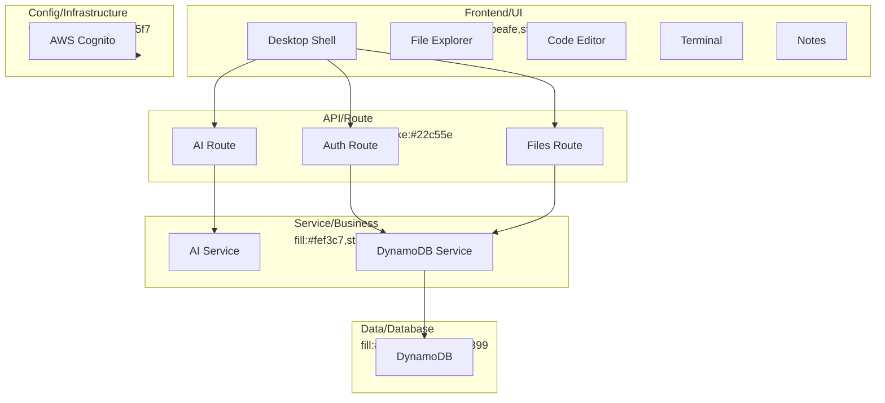
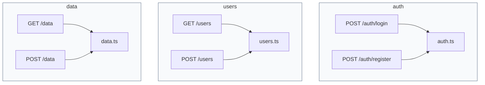

# My-os - Documentation

## Project Overview

```
The `repo_254d7fa0211e` repository is a comprehensive WebOS project that simulates a desktop environment within a web application. The project is structured into several key components: `ai-service`, `backend`, and `frontend`. 

The `ai-service` folder contains a Python-based AI service, configured via `.env.example` and `requirements.txt`. The `backend` folder is a TypeScript-based server, utilizing Node.js and DynamoDB for data persistence. It includes routes for AI, authentication, and file management, all secured with middleware for authentication. 

The `frontend` is a React-based application, styled with Tailwind CSS, that provides the user interface for the WebOS. It includes components for a desktop shell, terminal, code editor, file explorer, and notes app. The frontend communicates with the backend via API calls, managed through stores and utilities for state management and command execution. 

This project is intended for developers looking to create a web-based operating system with advanced features like AI assistance and AWS Cognito authentication. The documentation is extensive, with files like `ARCHITECTURE.md`, `FEATURES.md`, and `DEVELOPER_GUIDE.md` providing detailed insights into the project's structure, capabilities, and development guidelines.
```

## Architecture

```markdown
## Architecture

### Overview

The WebOS project is structured to facilitate a modular and scalable architecture, allowing for easy maintenance and extension. The codebase is divided into several key components, each serving a specific purpose.

### Key Components

1. **Frontend**:
    - **Location**: `frontend/`
    - **Description**: The frontend is built using React and TypeScript. It includes components for the desktop shell, applications (like the terminal, code editor, file explorer, and notes app), and utility functions.
    - **Main Files**:
        - `App.tsx`: The main application component.
        - `main.tsx`: The entry point for the React application.
        - `components/`: Directory containing all reusable UI components.
        - `stores/`: Directory for state management using MobX.
        - `utils/`: Utility functions and helpers.

2. **Backend**:
    - **Location**: `backend/`
    - **Description**: The backend is built using Node.js and TypeScript. It handles API routes, middleware, and service interactions.
    - **Main Files**:
        - `server.ts`: The main server entry point.
        - `middleware/`: Directory for middleware functions (e.g., authentication).
        - `routes/`: Directory for API route definitions.
        - `services/`: Directory for service layer interactions (e.g., DynamoDB).

3. **AI Service**:
    - **Location**: `ai-service/`
    - **Description**: A separate service for AI-related functionalities, built using Python.
    - **Main Files**:
        - `main.py`: The entry point for the AI service.
        - `requirements.txt`: Python dependencies for the AI service.

4. **Specifications and Steering**:
    - **Location**: `.kiro/`
    - **Description**: Contains detailed specifications and architectural guidelines for the project.
    - **Main Files**:
        - `specs/`: Directory with markdown files detailing each feature and component.
        - `steering/`: Directory with architectural rules, DynamoDB schema, product overview, and tech stack details.

### Data Flow

- **Frontend to Backend**: The frontend sends requests to the backend via API routes. The backend processes these requests, interacts with services (e.g., DynamoDB), and sends responses back to the frontend.
- **AI Service**: The AI service can be invoked by the backend for specific AI-related tasks. The results are then sent back to the frontend via the backend.

### Design Patterns

- **MVC (Model-View-Controller)**: Used in the backend to separate concerns between data (models), user interface (views), and control flow (controllers).
- **MobX for State Management**: Used in the frontend to manage application state in a reactive manner.
- **Service Layer**: Encapsulates business logic and database interactions in the backend.

### Main Entry Points

- **Frontend**: `main.tsx`
- **Backend**: `server.ts`
- **AI Service**: `main.py`

### Practical Notes

- **Environment Variables**: Both the frontend and backend use `.env.example` files to define environment variables. Ensure these are correctly set up in your local environment.
- **Dependency Management**: Use `package.json` in the frontend and backend directories to manage npm dependencies. The AI service uses `requirements.txt` for Python dependencies.
- **Build and Run**: Follow the instructions in `SETUP.md` to set up and run the project locally.
```

### Architecture Diagram



### Data Flow

```mermaid
flowchart LR
  style Entry fill:#dbeafe,stroke:#3b82f6,color:#1e40af
  style Processing fill:#f0fdf4,stroke:#22c55e,color:#166534
  style Store fill:#fef3c7,stroke:#f59e0b,color:#92400e
  style Output fill:#fce7f3,stroke:#ec4899,color:#9d174d

  Entry[[Entry]]:::Entry --> Processing[[Router]]:::Processing
  Processing --> Processing[[Controller]]:::Processing
  Processing --> Processing[[Service]]:::Processing
  Processing --> Store[[(DynamoDB)]]:::Store
  Store --> Processing[[Transform]]:::Processing
  Processing --> Output[[Response]]:::Output
```

### API Endpoint Map



## Directory Structure

```
├── ARCHITECTURE.md
├── CHANGELOG.md
├── CONTRIBUTING.md
├── DEVELOPER_GUIDE.md
├── FEATURES.md
├── FILE_INDEX.md
├── LICENSE
├── PROJECT_STATUS.md
├── QUICKSTART.md
├── README.md
├── SETUP.md
├── SUMMARY.md
├── package.json
├── .kiro/
│   ├── specs/
│   │   ├── 01-desktop-shell.md
│   │   ├── 02-virtual-filesystem.md
│   │   ├── 03-terminal-app.md
│   │   ├── 04-code-editor-app.md
│   │   ├── 05-file-explorer-app.md
│   │   ├── 06-notes-app.md
│   │   ├── 07-browser-app.md
│   │   ├── 08-auth-cognito.md
│   │   ├── 09-dynamo-persistence.md
│   │   ├── 10-ai-assistant.md
│   │   └── 11-advanced-features.md
│   └── steering/
│       ├── architecture.md
│       ├── dynamo-schema.md
│       ├── product.md
│       └── tech-stack.md
├── ai-service/
│   ├── .env.example
│   ├── Procfile
│   ├── README.md
│   ├── main.py
│   └── requirements.txt
├── backend/
│   ├── .env.example
│   ├── Procfile
│   ├── package.json
│   ├── tsconfig.json
│   └── src/
│       ├── server.ts
│       ├── middleware/
│       │   └── authMiddleware.ts
│       ├── routes/
│       │   ├── ai.ts
│       │   ├── auth.ts
│       │   └── files.ts
│       ├── services/
│       │   └── dynamoService.ts
│       └── types/
│           └── index.ts
├── frontend/
│   ├── .env.example
│   ├── index.html
│   ├── package.json
│   ├── postcss.config.js
│   ├── tailwind.config.js
│   ├── tsconfig.json
│   ├── vercel.json
│   ├── vite.config.ts
│   ├── public/
│   │   ├── favicon.svg
│   │   └── icons.svg
│   └── src/
│       ├── App.tsx
│       ├── main.tsx
│       ├── style.css
│       ├── assets/
│       │   ├── hero.png
│       │   ├── typescript.svg
│       │   └── vite.svg
│       ├── components/
│       │   ├── AppLauncher.tsx
│       │   ├── Desktop.tsx
│       │   ├── LoginScreen.tsx
│       │   ├── Taskbar.tsx
│       │   ├── WindowFrame.tsx
│       │   ├── WindowManager.tsx
│       │   ├── CodeEditor/
│       │   │   └── index.tsx
│       │   ├── FileExplorer/
│       │   │   ├── TreeNode.tsx
│       │   │   └── index.tsx
│       │   ├── Notes/
│       │   │   └── index.tsx
│       │   └── Terminal/
│       │       └── index.tsx
│       ├── stores/
│       │   ├── authStore.ts
│       │   ├── editorStore.ts
│       │   ├── fileSystemStore.ts
│       │   ├── themeStore.ts
│       │   └── windowStore.ts
│       ├── types/
│       │   └── index.ts
│       └── utils/
│           ├── appRegistry.ts
│           └── commandExecutor.ts
└── nitinog10-My-os-abc387d/
    ├── ARCHITECTURE.md
    ├── CHANGELOG.md
    ├── CONTRIBUTING.md
    ├── DEVELOPER_GUIDE.md
    ├── FEATURES.md
    ├── FILE_INDEX.md
    ├── LICENSE
    ├── PROJECT_STATUS.md
    ├── QUICKSTART.md
    ├── README.md
    ├── SETUP.md
    ├── SUMMARY.md
    ├── package.json
    ├── .kiro/
    │   ├── specs/
    │   │   ├── 01-desktop-shell.md
    │   │   ├── 02-virtual-filesystem.md
    │   │   ├── 03-terminal-app.md
    │   │   ├── 04-code-editor-app.md
    │   │   ├── 05-file-explorer-app.md
    │   │   ├── 06-notes-app.md
    │   │   ├── 07-browser-app.md
    │   │   ├── 08-auth-cognito.md
    │   │   ├── 09-dynamo-persistence.md
    │   │   ├── 10-ai-assistant.md
    │   │   └── 11-advanced-features.md
    │   └── steering/
    │       ├── architecture.md
    │       ├── dynamo-schema.md
    │       ├── product.md
    │       └── tech-stack.md
    ├── ai-service/
    │   ├── .env.example
    │   ├── Procfile
    │   ├── README.md
    │   ├── main.py
    │   └── requirements.txt
    ├── backend/
    │   ├── .env.example
    │   ├── Procfile
    │   ├── package.json
    │   ├── tsconfig.json
    │   └── src/
    │       ├── server.ts
    │       ├── middleware/
    │       │   └── authMiddleware.ts
    │       ├── routes/
    │       │   ├── ai.ts
    │       │   ├── auth.ts
    │       │   └── files.ts
    │       ├── services/
    │       │   └── dynamoService.ts
    │       └── types/
    │           └── index.ts
    └── frontend/
        ├── .env.example
        ├── index.html
        ├── package.json
        ├── postcss.config.js
        ├── tailwind.config.js
        ├── tsconfig.json
        ├── vercel.json
        ├── vite.config.ts
        ├── public/
        │   ├── favicon.svg
        │   └── icons.svg
        └── src/
            ├── App.tsx
            ├── main.tsx
            ├── style.css
            ├── assets/
            │   ├── hero.png
            │   ├── typescript.svg
            │   └── vite.svg
            ├── components/
            │   ├── AppLauncher.tsx
            │   ├── Desktop.tsx
            │   ├── LoginScreen.tsx
            │   ├── Taskbar.tsx
            │   ├── WindowFrame.tsx
            │   ├── WindowManager.tsx
            │   ├── CodeEditor/
            │   │   └── index.tsx
            │   ├── FileExplorer/
            │   │   ├── TreeNode.tsx
            │   │   └── index.tsx
            │   ├── Notes/
            │   │   └── index.tsx
            │   └── Terminal/
            │       └── index.tsx
            ├── stores/
            │   ├── authStore.ts
            │   ├── editorStore.ts
            │   ├── fileSystemStore.ts
            │   ├── themeStore.ts
            │   └── windowStore.ts
            ├── types/
            │   └── index.ts
            └── utils/
                ├── appRegistry.ts
                └── commandExecutor.ts
```

## Dependencies

```markdown
## Dependencies

### Major Libraries

- **React**: A JavaScript library for building user interfaces.
  - Version: Specified in `frontend/package.json`.
  - Purpose: Used for building the frontend components of the webos.

- **TypeScript**: A typed superset of JavaScript that compiles to plain JavaScript.
  - Version: Specified in `frontend/package.json`.
  - Purpose: Provides static type-checking for the frontend code.

- **AWS SDK**: A set of libraries and tools for interacting with AWS services.
  - Version: Specified in `backend/package.json`.
  - Purpose: Used for integrating AWS services in the backend.

### Version Constraints

- React and TypeScript versions are specified in the `frontend/package.json`.
- AWS SDK version is specified in the `backend/package.json`.

### Development Dependencies

- **Webpack**: A module bundler for JavaScript applications.
  - Version: Specified in `frontend/package.json`.
  - Purpose: Used for bundling frontend assets.

- **Nodemon**: A utility that monitors for any changes in your source and automatically restarts your server.
  - Version: Specified in `backend/package.json`.
  - Purpose: Used for automatically restarting the backend server during development.

### Production Dependencies

- **Express**: A minimal and flexible Node.js web application framework.
  - Version: Specified in `backend/package.json`.
  - Purpose: Used for building the backend server.

- **Python**: Used for running the AI service.
  - Version: Specified in `ai-service/requirements.txt`.
  - Purpose: Used for running the AI service code.
```

## File Reference

This section contains detailed documentation for each source file in the repository.

### `ARCHITECTURE.md`
**Language:** Md

#### Overview

# WebOS Architecture

#### Module Overview

This file provides a high-level overview of the WebOS system architecture, including system components, data flow, security measures, performance optimizations, scalability strategies, and future enhancements.

#### Dependencies

- **React**: Frontend framework
- **Zustand**: State management
- **Express**: Backend framework
- **AWS SDK**: AWS service integration
- **DynamoDB**: NoSQL database
- **Cognito**: Authentication service
- **Anthropic Claude API**: AI service integration

#### Classes

| Class            | Purpose                              | Key Methods                  |
|------------------|--------------------------------------|------------------------------|
| `App`            | Main application component           | `render()`                   |
| `LoginScreen`    | Authentication screen                | `handleLogin()`              |
| `Desktop`        | Main desktop interface               | `render()`                   |
| `WindowManager`  | Manages application windows          | `openWindow()`, `closeWindow()` |
| `WindowFrame`    | Individual window frame              | `handleDrag()`, `handleResize()` |
| `AppLauncher`    | Application launcher                 | `launchApp()`                |
| `Taskbar`        | System taskbar                       | `render()`                   |

#### Functions

| Function         | Parameters                  | Returns   | Description                  |
|------------------|-----------------------------|-----------|------------------------------|
| `handleLogin`    | `username`, `password`      | `Promise` | Authenticates user           |
| `openWindow`     | `appName`                   | `void`    | Opens a new application window |
| `closeWindow`    | `windowId`                  | `void`    | Closes a window by ID        |
| `launchApp`      | `appName`                   | `void`    | Launches a specified app     |

#### Configuration

- **Ports**:
  - Frontend: `3000`
  - Backend: `4000`
  - AI Service: `8000`

#### Constants

- **Stores**:
  - `windowStore`
  - `fileSystemStore`
  - `authStore`
  - `editorStore`
  - `themeStore`

#### Notes

- Ensure JWT tokens are securely stored and transmitted.
- DynamoDB queries should always include the user ID in the partition key to maintain data isolation.
- Use AWS CloudWatch for monitoring and logging backend activities.
- Implement lazy loading for heavy components to improve frontend performance.
- Consider using WebSockets for real-time features in future enhancements.

---

### `CHANGELOG.md`
**Language:** Md

#### Overview

# CHANGELOG.md

#### Module Overview

The `CHANGELOG.md` file serves as a historical record of all significant changes made to the WebOS project. It captures updates, new features, bug fixes, and other modifications in a structured format, allowing developers to track the evolution of the project.

#### Dependencies

There are no direct dependencies for this markdown file. It is a standalone document that relies on the markdown syntax for formatting.

#### Notes

- This file should be updated with every release to reflect changes made in the project.
- Ensure that each release section is added at the top of the file to maintain chronological order.
- Use semantic versioning (e.g., `1.0.0`, `1.1.0`) to denote the version of the release.

#### Known Issues

- Ensure that all changes, especially breaking changes, are clearly documented.
- Regularly review and clean up outdated sections to keep the file concise.

#### Feedback

Contributions to this file are welcome. If you notice any missing changes or have suggestions for improvement, please open a pull request or an issue.

---

### `CONTRIBUTING.md`
**Language:** Md

#### Overview

# Module Overview

This file provides guidelines and instructions for contributing to the WebOS project, including code of conduct, contribution types, development workflow, code style, testing, and pull request process.

#### Dependencies

None. This is a markdown file with plain text instructions.

#### Notes

- Ensure all contributions adhere to the code of conduct and contribution guidelines.
- Keep commit messages clear and follow the conventional commits format.
- Thoroughly test all changes and ensure documentation is updated if necessary.
- High-priority features are listed in `FEATURES.md`; consider tackling those for significant impact.
- All contributions are licensed under the MIT License.

---

### `DEVELOPER_GUIDE.md`
**Language:** Md

#### Overview

# WebOS Developer Guide

#### Module Overview

This file provides a comprehensive guide for developers working on the WebOS project, covering everything from adding new apps and creating Zustand stores to integrating APIs and optimizing performance.

#### Dependencies

- `React`: Core library for building user interfaces.
- `TypeScript`: Adds static type checking to JavaScript.
- `Tailwind CSS`: Utility-first CSS framework for styling.
- `Zustand`: Lightweight state management library.
- `Express`: Web framework for Node.js.
- `Axios`: Promise-based HTTP client for making API requests.
- `AWS SDK`: JavaScript SDK for interacting with AWS services.

#### Classes

None

#### Functions

| Function               | Parameters                 | Returns                  | Description                                                                                     |
|------------------------|----------------------------|--------------------------|-------------------------------------------------------------------------------------------------|
| `executeCommand`       | `cmd: string, cwd: string, root: FSNode | null` | `Promise<CommandResult>` | Executes a terminal command and returns the result.                                             |

#### Configuration

None

#### Constants

None

#### Notes

- Always test new features thoroughly before deploying.
- Use `React.memo`, `useCallback`, and `useMemo` for performance optimization where necessary.
- Ensure all API calls are secure and handle errors gracefully.
- Follow the provided coding style and conventions for consistency across the codebase.

---

### `FEATURES.md`
**Language:** Md

#### Overview

# WebOS Features

#### Module Overview

This file provides a comprehensive overview of the implemented, partially implemented, and not yet implemented features of WebOS. It serves as a roadmap for development and a reference for contributors.

#### Dependencies

None. This is a markdown file.

#### Notes

- The file uses markdown syntax for readability.
- Features are categorized into "Implemented", "Partially Implemented", and "Not Yet Implemented".
- The "Priority Roadmap" section outlines the development phases.
- The "Feature Completion" section provides a percentage completion for each module.
- The "Getting Started" section offers a quick guide to set up and run WebOS locally.
- The "Contributing" section directs developers to relevant documentation for implementing new features.

---

### `FILE_INDEX.md`
**Language:** Md

#### Overview

# Module Overview
Complete index of all project files with descriptions.

#### Dependencies

None. This is a markdown file.

#### Notes

- Keep this file updated with any new files added to the project.
- Use this file as a reference for navigating the codebase.
- All file descriptions should be concise and to the point.

---

### `LICENSE`
#### Overview

# LICENSE

#### Module Overview

This file contains the MIT License for the project. It grants permissions for the use, modification, distribution, and other rights regarding the software, while also specifying the conditions and limitations under which these rights apply.

#### Dependencies

No dependencies are listed in this file.

#### Classes

| Class | Purpose | Key Methods |
| --- | --- | --- |
| N/A | N/A | N/A |

#### Functions

| Function | Parameters | Returns | Description |
| --- | --- | --- | --- |
| N/A | N/A | N/A | N/A |

#### Notes

- This file is crucial for understanding the legal permissions and obligations associated with the software.
- Ensure that the license notice is included in all copies or substantial portions of the software as per the license terms.
- The software is provided "as is" without any warranties, so be cautious when relying on its functionality or integrating it into other projects.

---

### `PROJECT_STATUS.md`
**Language:** Md

#### Overview

# Module Overview
This file provides a snapshot of the current status of the WebOS project, including overall progress, component statuses, feature checklists, milestones, development timeline, known issues, next sprint goals, code statistics, quality metrics, learning resources, contact information, achievements, work in progress, and future vision.

#### Dependencies

None. This file is a markdown document and does not import any modules or dependencies.

#### Notes

- The progress bars and percentages are manually updated. Ensure these are kept current with actual project status.
- The `Known Issues` section should be reviewed regularly and updated as issues are resolved or new ones are identified.
- The `Next Sprint Goals` section is subject to change based on project priorities and team capacity.
- The `Code Statistics` and `Quality Metrics` sections provide a snapshot of the project's current state and should be updated periodically.
- The `Learning Resources` section is intended to help new contributors get up to speed quickly.
- The `Contact & Support` section provides channels for communication and support.
- The `Achievements` section highlights key milestones reached.
- The `Work in Progress` section lists features currently being worked on.
- The `Future Vision` section outlines the long-term goals for the project.
- The document is versioned and dated to track changes and updates over time.

---

### `QUICKSTART.md`
**Language:** Md

#### Overview

# QUICKSTART.md

This guide helps you get WebOS up and running in under 5 minutes.

#### Dependencies

- Node.js 18+
- Python 3.11+
- AWS Account
- Anthropic API key

#### Step 1: Clone and Install

```bash
# Clone the repository
git clone <your-repo-url>
cd webos

# Install all dependencies
npm run install:all

# Install AI service dependencies
cd ai-service
python -m venv venv
source venv/bin/activate  # Windows: venv\Scripts\activate
pip install -r requirements.txt
cd..
```

#### Step 2: AWS Setup

### DynamoDB

1. Go to AWS Console → DynamoDB
2. Create table: `webos-main`
3. Partition key: `PK` (String)
4. Sort key: `SK` (String)
5. Billing: On-demand

### Cognito

1. Go to AWS Console → Cognito
2. Create User Pool
3. Enable email sign-in
4. Create App Client (public, no secret)
5. Enable `ALLOW_USER_PASSWORD_AUTH`
6. Copy User Pool ID and Client ID

#### Step 3: Configure Environment

```bash
# Frontend
cp frontend/.env.example frontend/.env
# Edit: Add Cognito User Pool ID and Client ID

# Backend
cp backend/.env.example backend/.env
# Edit: Add AWS credentials and Cognito details

# AI Service
cp ai-service/.env.example ai-service/.env
# Edit: Add Anthropic API key
```

#### Step 4: Start Services

Open 3 terminals:

**Terminal 1:**

```bash
npm run dev:frontend
```

**Terminal 2:**

```bash
npm run dev:backend
```

**Terminal 3:**

```bash
cd ai-service
source venv/bin/activate  # Windows: venv\Scripts\activate
python main.py
```

#### Step 5: Use WebOS!

1. Open `http://localhost:3000`
2. Sign up with email/password
3. Explore the desktop!

#### What to Try

### Terminal

```bash
ls                    # List files
cd documents          # Change directory
cat welcome.txt       # Read file
echo "Hello WebOS"    # Print text
help                  # Show commands
```

### Code Editor

1. Click 📝 icon
2. Open File Explorer (📁 icon)
3. Double-click `welcome.txt`
4. Edit and save (auto-saves in 2s)

### File Explorer

1. Click 📁 icon
2. Browse folders
3. Double-click files to open in editor

### Notes

1. Click 📋 icon
2. Write Markdown on left
3. See preview on right

#### Troubleshooting

### Frontend won't start

```bash
cd frontend
rm -rf node_modules package-lock.json
npm install
npm run dev
```

### Backend won't start

- Check AWS credentials
- Verify DynamoDB table exists
- Check Cognito configuration

### AI Service won't start

- Check Python version: `python --version`
- Verify virtual environment is activated
- Check Anthropic API key

### Can't login

- Verify Cognito User Pool exists
- Check App Client configuration
- Ensure `ALLOW_USER_PASSWORD_AUTH` is enabled

#### Next Steps

- Read `README.md` for full documentation
- Check `FEATURES.md` for available features
- See `DEVELOPER_GUIDE.md` to add features
- Review `ARCHITECTURE.md` for system design

#### Need Help?

- Check documentation files
- Open an issue on GitHub
- Join Discord community

#### Production Deployment

See `SETUP.md` for production deployment instructions to:

- Vercel (Frontend)
- Railway (Backend + AI Service)

Enjoy WebOS! 🚀

---

### `README.md`
**Language:** Md

File too large for inline documentation.

---

### `SETUP.md`
**Language:** Md

#### Overview

# SETUP.md

#### Module Overview

This file provides a comprehensive guide for setting up the WebOS project, covering installation, configuration, and deployment steps. It's designed to help developers get the project up and running quickly.

#### Dependencies

- `npm`: Node package manager for installing JavaScript dependencies.
- `python`: Programming language for the AI service.
- `pip`: Python package installer for managing Python dependencies.

#### AWS Setup (Required)

### DynamoDB Table Setup

1. Go to AWS Console → DynamoDB
2. Create table:
   - Table name: `webos-main`
   - Partition key: `PK` (String)
   - Sort key: `SK` (String)
   - Billing mode: On-demand
3. Click "Create table"

### Cognito User Pool Setup

1. Go to AWS Console → Cognito
2. Create User Pool:
   - Sign-in options: Email
   - Password policy: Default
   - MFA: Optional (recommended: OFF for development)
   - User account recovery: Email only
   - Self-service sign-up: Enabled
   - Attribute verification: Email
3. Configure App Client:
   - App type: Public client
   - App client name: `webos-client`
   - Authentication flows: `ALLOW_USER_PASSWORD_AUTH`, `ALLOW_REFRESH_TOKEN_AUTH`
   - Don't generate client secret
4. Note your:
   - User Pool ID (e.g., `us-east-1_xxxxxxxxx`)
   - App Client ID (e.g., `xxxxxxxxxxxxxxxxxxxxxxxxxx`)

### IAM Permissions

Your AWS credentials need these permissions:
- `dynamodb:GetItem`
- `dynamodb:PutItem`
- `dynamodb:Query`
- `dynamodb:DeleteItem`
- `cognito-idp:InitiateAuth`
- `cognito-idp:SignUp`

#### OpenAI API Key

1. Go to https://platform.openai.com/
2. Create an account or sign in
3. Navigate to API Keys
4. Create a new API key
5. Copy the key (starts with `sk-`)
6. Add to `ai-service/.env`: `OPENAI_API_KEY=sk-...`

Note: OpenAI offers pay-as-you-go pricing. GPT-3.5-turbo is very affordable (~$0.0005 per 1K tokens).

#### Quick Start (Development)

### 1. Install Dependencies

```bash
# Install frontend and backend dependencies
npm run install:all

# Install AI service dependencies
cd ai-service
python -m venv venv
source venv/bin/activate  # Windows: venv\Scripts\activate
pip install -r requirements.txt
cd..
```

### 2. Configure Environment Variables

```bash
# Frontend
cp frontend/.env.example frontend/.env
# Edit frontend/.env with your AWS Cognito credentials

# Backend
cp backend/.env.example backend/.env
# Edit backend/.env with your AWS credentials

# AI Service
cp ai-service/.env.example ai-service/.env
# Edit ai-service/.env with your Anthropic API key
```

### 3. Start All Services

Open 3 terminal windows:

**Terminal 1 - Frontend:**
```bash
npm run dev:frontend
```

**Terminal 2 - Backend:**
```bash
npm run dev:backend
```

**Terminal 3 - AI Service:**
```bash
cd ai-service
source venv/bin/activate  # Windows: venv\Scripts\activate
python main.py
```

### 4. Access WebOS

Open your browser to `http://localhost:3000`

#### Testing the Setup

### 1. Test Backend Health
```bash
curl http://localhost:4000/health
# Should return: {"status":"ok"}
```

### 2. Test AI Service Health
```bash
curl http://localhost:8000/health
# Should return: {"status":"ok"}
```

### 3. Test Frontend
- Open `http://localhost:3000`
- You should see the login screen
- Try signing up with a test account

#### Troubleshooting

### Frontend won't start
- Check Node.js version (18+)
- Delete `node_modules` and run `npm install` again
- Check for port conflicts on 3000

### Backend won't start
- Check AWS credentials are configured
- Verify DynamoDB table exists
- Check Cognito User Pool ID and Client ID
- Check for port conflicts on 4000

### AI Service won't start
- Check Python version (3.11+)
- Verify virtual environment is activated
- Check Anthropic API key is valid
- Check for port conflicts on 8000

### Authentication fails
- Verify Cognito User Pool configuration
- Check App Client has correct auth flows enabled
- Ensure no client secret is configured
- Check AWS region matches in all configs

### File system not loading
- Verify DynamoDB table exists
- Check AWS credentials have DynamoDB permissions
- Check table name matches in backend .env

#### Production Deployment

### Frontend (Vercel)
1. Push code to GitHub
2. Import project in Vercel
3. Set root directory to `frontend`
4. Add environment variables
5. Deploy

### Backend (Railway)
1. Create new project in Railway
2. Add Node.js service
3. Set root directory to `backend`
4. Add environment variables
5. Deploy

### AI Service (Railway)
1. Add Python service to same project
2. Set root directory to `ai-service`
3. Add environment variables
4. Deploy

### Update Frontend API URL
After deploying backend and AI service, update:
- `frontend/.env` → `VITE_API_URL` to backend URL
- `backend/.env` → `AI_SERVICE_URL` to AI service URL

#### Next Steps

- Customize the wallpaper and theme
- Add more terminal commands
- Implement file upload/download
- Add more apps (Browser, Calculator, etc.)
- Implement keyboard shortcuts
- Add notification system
- Implement search functionality

#### Notes

- Ensure all environment variables are correctly set in their respective `.env` files.
- Double-check AWS region consistency across all services.
- Keep API keys secure and avoid hardcoding them in the codebase.

---

### `SUMMARY.md`
**Language:** Md

#### Overview

# Module Overview

This file provides a complete summary of the WebOS project, detailing the current implementation status, project structure, core features, technology stack, and future plans.

#### Dependencies

- **Markdown**: For formatting the document.

#### Notes

- This document is intended for both developers and users to understand the current state and capabilities of WebOS.
- The project is currently 75% complete, with core functionality and four functional applications.
- Detailed setup and contribution guidelines are available in the documentation folder.
- The project uses modern web technologies and cloud services, with a focus on type safety and clean architecture.
- Future plans include additional applications, mobile support, and real-time collaboration features.

---

### `package.json`
**Language:** Json

#### Overview

# package.json Module Overview

This file defines the metadata and dependencies for our project. It outlines the project name, version, and description, and specifies scripts for various development tasks.

#### Dependencies

No direct dependencies are listed here, but it references scripts that rely on packages installed in `frontend`, `backend`, and `ai-service` directories.

#### Functions

| Function | Parameters | Returns | Description |
|----------|------------|---------|-------------|
| `install:all` | None | None | Installs dependencies in frontend, backend, and ai-service directories. |
| `dev:frontend` | None | None | Runs development server for the frontend. |
| `dev:backend` | None | None | Runs development server for the backend. |
| `dev:ai` | None | None | Runs the AI service in Python. |
| `build:frontend` | None | None | Builds the production version of the frontend. |
| `build:backend` | None | None | Builds the production version of the backend. |

#### Notes

- Always ensure you are in the correct directory when running scripts from `package.json`.
- The `install:all` script assumes that `frontend`, `backend`, and `ai-service` directories exist and contain their own `package.json` files.
- The `dev:ai` script requires a Python environment to run.

---

### `.kiro/specs/01-desktop-shell.md`
**Language:** Md

#### Overview

# Module Overview

This file defines the core components and structure for the desktop shell of our OS environment. It encompasses the desktop canvas, window system, taskbar, and app launcher, ensuring a seamless and interactive user experience.

#### Dependencies

| Import | Purpose |
| --- | --- |
| `react-rnd` | Provides draggable and resizable window functionality. |
| `Framer Motion` | Manages animations for window states and launcher transitions. |
| `Zustand` | State management for window and theme stores. |
| `Tailwind CSS` | Styling, particularly for the glassmorphism theme. |

#### Classes

| Class | Purpose | Key Methods |
| --- | --- | --- |
| `WindowManager` | Renders all open windows from the store. | `renderWindows()` |
| `WindowFrame` | Wrapper for draggable and resizable windows. | `handleDrag()`, `handleResize()` |

#### Functions

| Function | Parameters | Returns | Description |
| --- | --- | --- | --- |
| `openWindow` | `windowId`, `windowName`, `windowComponent` | `void` | Adds a new window to the store. |
| `closeWindow` | `windowId` | `void` | Removes a window from the store. |
| `minimizeWindow` | `windowId` | `void` | Minimizes a window in the store. |
| `focusWindow` | `windowId` | `void` | Brings a window to the front. |

#### Configuration

No specific configuration is required for this module. The theme and state management are handled via Zustand slices and Tailwind CSS.

#### Notes

- Ensure all windows are correctly stacked by focus to maintain the correct z-index.
- The `WindowManager` should efficiently handle opening, closing, and minimizing windows without performance lag.
- The glassmorphism theme should be consistently applied across all components using Tailwind CSS classes.
- The taskbar should update in real time to reflect running applications.
- Animations for window states and launcher transitions should be smooth and responsive.

---

### `.kiro/specs/02-virtual-filesystem.md`
**Language:** Md

#### Overview

# Module Overview

This file defines the in-memory virtual file system, which is synced to DynamoDB for persistence. It provides a full CRUD interface for managing a tree structure of folders and files, with operations like creating, deleting, renaming, and moving nodes, as well as reading and writing file content.

#### Dependencies

- **Zustand**: State management for the in-memory file system.
- **DynamoDB**: NoSQL database for persistent storage.

#### Classes

| Class | Purpose | Key Methods |
| --- | --- | --- |
| `FSNode` | TypeScript interface for file system nodes | N/A |

#### Functions

| Function | Parameters | Returns | Description |
| --- | --- | --- | --- |
| `createFile` | `parentPath`, `name`, `content` | `FSNode` | Creates a new file under the specified parent path. |
| `createFolder` | `parentPath`, `name` | `FSNode` | Creates a new folder under the specified parent path. |
| `deleteNode` | `path` | `boolean` | Deletes the node at the specified path. |
| `renameNode` | `oldPath`, `newName` | `boolean` | Renames the node at the old path to the new name. |
| `moveNode` | `oldPath`, `newParentPath` | `boolean` | Moves the node from the old path to the new parent path. |
| `readFile` | `path` | `string` | Reads the content of the file at the specified path. |
| `writeFile` | `path`, `content` | `boolean` | Writes the content to the file at the specified path. |

#### Configuration

- **DynamoDB Keys**:
  - `PK`: `user#<userId>`
  - `SK`: `FS#<fullPath>`
  - `Data`: `{ type, name, content, size, createdAt, updatedAt, parentPath }`

#### Notes

- Ensure all file operations are properly synced to DynamoDB.
- The default file tree is seeded on new user creation.
- Path-based addressing must be correctly resolved for all operations.
- File content must be saved on every write operation.

---

### `.kiro/specs/03-terminal-app.md`
**Language:** Md

#### Overview

# Module Overview

This file defines the specifications for a terminal application that simulates a command-line interface (CLI) within a window, complete with a command execution engine. It outlines the requirements, tasks, and acceptance criteria for developing this terminal app.

#### Dependencies

| Import | Purpose |
| --- | --- |
| `Zustand` | State management for terminal session data. |
| `FileSystemStore` | Manages file and directory operations. |
| `UIComponents` | Provides UI elements like terminal prompt and output area. |

#### Classes

| Class | Purpose | Key Methods |
| --- | --- | --- |
| `TerminalApp` | Manages the terminal's state and interactions. | `initialize`, `updatePrompt`, `executeCommand` |

#### Functions

| Function | Parameters | Returns | Description |
| --- | --- | --- | --- |
| `parseInput` | `input` | `ParsedCommand` | Splits user input into command and arguments. |
| `executeCommand` | `command`, `args` | `string` | Executes the given command and returns the output. |
| `updateHistory` | `command`, `args` | `void` | Adds the command to the history. |

#### Configuration

No specific configuration is required for this module.

#### Notes

- Ensure that the terminal state (current working directory, command history) is correctly persisted and retrieved from Zustand.
- Validate all commands before execution to avoid errors.
- The `ai` command should be handled separately to avoid cluttering the terminal output with AI responses.

---

### `.kiro/specs/04-code-editor-app.md`
**Language:** Md

#### Overview

# **kiro/specs/04-code-editor-app.md**

#### Module Overview

This file outlines the specifications for the Monaco-based code editor app, which provides syntax highlighting and multi-tab support. It includes the requirements, tasks, and acceptance criteria for implementing the code editor within our application.

#### Dependencies

| Import | Purpose |
| --- | --- |
| `@monaco-editor/react` | React wrapper for Monaco Editor |
| `Zustand` | State management for active tab |
| `fileSystemStore` | Manages file read/write operations |

#### Classes

| Class | Purpose | Key Methods |
| --- | --- | --- |
| `CodeEditor` | Main component for the Monaco editor | `renderEditor`, `handleFileOpen`, `handleFileSave` |
| `TabBar` | Manages tabs and their close actions | `addTab`, `closeTab`, `selectTab` |
| `FileSidebar` | Displays file tree and allows file opening | `renderFileTree`, `openFile` |

#### Functions

| Function | Parameters | Returns | Description |
| --- | --- | --- | --- |
| `openTab` | `fileContent`, `fileName` | `tabId` | Adds a new tab with given file content and name |
| `closeTab` | `tabId` | `void` | Closes the tab with given ID |
| `saveFile` | `tabId`, `fileContent` | `void` | Writes file content to `fileSystemStore` |

#### Configuration

- **Themes**: Configure Monaco Editor themes, including dark mode.
- **Auto-save**: Debounced auto-save interval set to 2 seconds.

#### Notes

- Ensure all file types are registered for syntax highlighting.
- Active tab state must be correctly persisted in Zustand.
- File operations should be integrated seamlessly with `fileSystemStore`.
- Handle edge cases where files may not open correctly due to read permissions or file corruption.

---

### `.kiro/specs/05-file-explorer-app.md`
**Language:** Md

#### Overview

# Module Overview

This file defines the specifications for the File Explorer App, a visual file browser with a tree view, context menus, and file operations. It outlines the requirements, tasks, and acceptance criteria for implementing the feature.

#### Dependencies

| Import | Purpose |
| --- | --- |
| `TreeNode` | Recursive component for rendering tree nodes. |
| `ContextMenu` | Component for handling right-click context menu actions. |
| `Breadcrumb` | Component for displaying breadcrumb navigation. |
| `fileSystemStore` | Store for managing file system state. |
| `lucide-react` | Icons for file types and folders. |

#### Classes

| Class | Purpose | Key Methods |
| --- | --- | --- |
| `FileExplorer` | Main component for the file explorer app. | `render()` |

#### Functions

| Function | Parameters | Returns | Description |
| --- | --- | --- | --- |
| `createTreeNode` | `node` | `JSX.Element` | Generates a tree node component. |
| `handleContextMenu` | `event`, `filePath` | `void` | Handles context menu actions. |
| `openInEditor` | `filePath` | `void` | Opens a file in the code editor. |

#### Configuration

No configuration settings are defined in this file.

#### Notes

- Ensure the tree view accurately reflects the current file system state.
- Context menu actions must correctly interact with the `fileSystemStore`.
- Double-clicking a file should reliably open it in the code editor.
- Breadcrumb navigation must accurately represent the current path in the file system.

---

### `.kiro/specs/06-notes-app.md`
**Language:** Md

#### Overview

# Module Overview

This file outlines the specifications for the Notes App, a simple rich-text note-taking application that supports markdown input and preview. It includes requirements, tasks, and acceptance criteria to guide the development and ensure the app meets its intended functionality.

#### Dependencies

| Import | Purpose | Description |
| --- | --- | --- |
| `marked` | Markdown Parsing | Parses markdown input into HTML. |
| `react-router-dom` | Routing | Manages navigation between different parts of the app. |
| `fileSystemStore` | File Operations | Handles file reading and writing operations. |

#### Classes

| Class | Purpose | Key Methods |
| --- | --- | --- |
| `NotesEditor` | Markdown Input | `saveNote()`, `loadNote()` |
| `NotesPreview` | Markdown Preview | `renderMarkdown()` |
| `NotesList` | Saved Notes List | `fetchNotes()`, `deleteNote()` |

#### Functions

| Function | Parameters | Returns | Description |
| --- | --- | --- | --- |
| `createFile` | `filename`, `content` | `Promise<void>` | Writes content to a new file. |
| `readFile` | `filename` | `Promise<string>` | Reads content from a file. |

#### Configuration

No specific configuration is required for this module.

#### Notes

- Ensure markdown rendering is accurate and handles edge cases like invalid markdown.
- File paths should be validated to avoid security vulnerabilities.
- The save and load operations must handle errors gracefully to maintain user experience.
- The preview pane should update in real-time as the user types in the editor.

---

### `.kiro/specs/07-browser-app.md`
**Language:** Md

#### Overview

# Module Overview

This file defines the specifications for the embedded iframe browser component within our application. It includes the requirements, tasks, and acceptance criteria for implementing a basic browser app with URL input, navigation controls, and error handling.

#### Dependencies

| Import | Purpose |
| --- | --- |
| `react` | Core library for building the UI |
| `@types/react` | TypeScript types for React |
| `styled-components` | For styling the browser component |

#### Classes

| Class | Purpose | Key Methods |
| --- | --- | --- |
| `Browser` | Main component for the browser app | `componentDidMount`, `handleUrlChange`, `handleRefresh` |
| `AddressBar` | Component for the URL input bar | `handleChange`, `handleSubmit` |
| `NavigationControls` | Component for navigation buttons | `handleBack`, `handleForward` |

#### Functions

| Function | Parameters | Returns | Description |
| --- | --- | --- | --- |
| `loadUrl` | `url: string` | `void` | Loads the specified URL in the iframe |
| `handleError` | `error: Error` | `void` | Displays an error message for failed URL loads |

#### Configuration

No specific configuration settings are defined in this file.

#### Notes

- CORS limitations mean some external URLs may not load due to browser security policies.
- The default homepage is set to `about:blank`, but can be customized.
- Navigation controls are currently disabled for version 1, but the UI is implemented for future use.
- Error handling for blocked URLs should be user-friendly and informative.

---

### `.kiro/specs/08-auth-cognito.md`
**Language:** Md

#### Overview

# Module Overview

This file defines the specifications for integrating AWS Cognito into our application for user authentication. It outlines the requirements, tasks, and acceptance criteria for implementing Cognito-based login, signup, and JWT management.

#### Dependencies

| Import | Purpose |
| --- | --- |
| `AWS` | Provides AWS SDK for Cognito operations. |
| `Zustand` | State management library used for `authStore`. |
| `express` | Middleware for backend JWT validation. |

#### Classes

| Class | Purpose | Key Methods |
| --- | --- | --- |
| `CognitoService` | Manages AWS Cognito interactions. | `initiateAuth`, `refreshToken` |

#### Functions

| Function | Parameters | Returns | Description |
| --- | --- | --- | --- |
| `createUserPool` | `userPoolDetails` | `UserPool` object | Creates a new Cognito User Pool. |
| `validateJWT` | `token` | `Boolean` | Validates the provided JWT token. |

#### Configuration

| Config | Purpose |
| --- | --- |
| `COGNITO_USER_POOL_ID` | ID of the Cognito User Pool. |
| `COGNITO_APP_CLIENT_ID` | Client ID for the Cognito app client. |

#### Notes

- Ensure JWTs are stored in memory and not in `localStorage` to avoid security risks.
- Auto-refresh tokens before expiry to maintain user sessions without interruption.
- Handle edge cases where user data is not available or defaults need to be seeded.
- Validate all API requests with JWT middleware to ensure secure access.

---

### `.kiro/specs/09-dynamo-persistence.md`
**Language:** Md

#### Overview

# Module Overview

This file defines the backend integration with DynamoDB for persisting user data. It includes the setup for AWS SDK, service layer for CRUD operations, and routes for handling data persistence across various user data types.

#### Dependencies

| Import | Purpose |
| --- | --- |
| `AWS SDK v3` | Provides AWS DynamoDB client and operations. |
| `dynamoClient.ts` | Sets up the DynamoDB client using AWS SDK v3. |
| `dynamoService.ts` | Contains CRUD helper methods for DynamoDB operations. |

#### Classes

| Class | Purpose | Key Methods |
| --- | --- | --- |
| `DynamoClient` | Manages DynamoDB client instance. | `getDynamoClient()` |

#### Functions

| Function | Parameters | Returns | Description |
| --- | --- | --- | --- |
| `createDynamoClient` | None | `DynamoDBClient` | Initializes and returns a DynamoDB client instance. |
| `saveUserProfile` | `userProfile` | `Promise<void>` | Saves user profile data to DynamoDB. |
| `loadUserProfile` | `userId` | `Promise<UserProfile>` | Retrieves user profile data from DynamoDB. |
| `syncFileSystem` | `fileSystemData` | `Promise<void>` | Syncs file system data to DynamoDB. |
| `batchWriteFileSystem` | `fileSystemItems` | `Promise<void>` | Batch writes file system items to DynamoDB. |

#### Configuration

| Setting | Purpose |
| --- | --- |
| `DYNAMO_TABLE_NAME` | Name of the DynamoDB table used for persistence. |
| `DYNAMO_REGION` | AWS region where DynamoDB is hosted. |

#### Notes

- Ensure all error handling middleware is properly configured to manage DynamoDB exceptions.
- Batch operations should be tested for performance under load.
- User data sync operations must adhere to the single-table design schema outlined in `dynamo-schema.md`.
- All routes must handle authentication and authorization checks before performing any data operations.

---

### `.kiro/specs/10-ai-assistant.md`
**Language:** Md

#### Overview

# Module Overview

This file defines the specifications for the AI Assistant feature, which includes a context-aware chat panel powered by the Claude API through a FastAPI microservice. The goal is to provide a seamless interaction experience with real-time streamed responses and contextual information.

#### Dependencies

| Import | Purpose |
| --- | --- |
| `FastAPI` | Framework for building the microservice. |
| `claude_client` | Client for interacting with the Claude API. |
| `sse` | Support for Server-Sent Events. |

#### Classes

| Class | Purpose | Key Methods |
| --- | --- | --- |
| `AIAssistant` | Manages the AI chat panel and interactions. | `init()`, `process_message()`, `stream_response()` |

#### Functions

| Function | Parameters | Returns | Description |
| --- | --- | --- | --- |
| `get_context()` | None | Context dict | Retrieves current context (file, cwd, recent commands). |
| `send_message()` | `message`, `context` | Response stream | Sends a message to the Claude API and returns a streamed response. |

#### Configuration

No specific configuration is required for this module.

#### Notes

- Ensure that the `context` object is always updated before sending a message to the Claude API.
- The `stream_response()` method should handle real-time updates and chunked responses from the Claude API.
- The "Insert to Editor" and "Run in Terminal" buttons must be wired correctly to their respective functionalities in the UI and terminal.

---

### `.kiro/specs/11-advanced-features.md`
**Language:** Md

#### Overview

# Module Overview

This file, `**kiro/specs/11-advanced-features.md**`, outlines the advanced features and requirements for enhancing the production readiness of our application. It details the specific functionalities we aim to implement, including settings customization, keyboard shortcuts, window snapping, notifications, and performance optimizations.

#### Dependencies

| Import | Purpose |
| --- | --- |
| `react` | Core React library for component creation and state management. |
| `react-dom` | Library for rendering React components to the DOM. |
| `react-window` | Library for efficiently rendering large lists and grids. |
| `redux` | State management library for managing application-wide state. |

#### Classes

| Class | Purpose | Key Methods |
| --- | --- | --- |
| `Settings` | Manages user settings like theme, wallpaper, and accent color. | `updateSettings(settings)`, `loadSettings()` |
| `KeyboardShortcuts` | Handles global keyboard shortcut functionality. | `registerShortcuts()`, `unregisterShortcuts()` |
| `NotificationManager` | Manages notification display and lifecycle. | `showNotification(message)`, `dismissNotification()` |
| `WindowFrame` | Implements window snapping functionality. | `snapWindow(direction)`, `detectSnapZones()` |
| `SystemTray` | Manages system tray icons for battery, wifi, and volume. | `updateTrayIcons()`, `renderTrayIcons()` |

#### Functions

| Function | Parameters | Returns | Description |
| --- | --- | --- | --- |
| `createSettingsStore` | `initialState` | `store` | Initializes Redux store for settings. |
| `initializeKeyboardShortcuts` | `shortcuts` | `void` | Sets up global keyboard shortcuts. |
| `displayNotification` | `message`, `duration` | `void` | Displays a notification with optional auto-dismiss. |
| `enableWindowSnapping` | `window` | `void` | Enables snapping functionality for a given window. |
| `renderSystemTray` | `icons` | `JSX.Element` | Renders the system tray with provided icons. |

#### Configuration

| Configuration | Purpose |
| --- | --- |
| `settingsConfig` | Defines default settings and their types. |
| `shortcutsConfig` | Lists predefined keyboard shortcuts and their actions. |
| `notificationConfig` | Sets default notification display durations and styles. |

#### Notes

- Ensure that all keyboard shortcuts are globally accessible and do not conflict with system shortcuts.
- Performance optimizations, such as lazy loading and virtualization, should be rigorously tested with large datasets to avoid lag.
- Error boundaries should be added around critical components to prevent application crashes from affecting the entire UI.
- Notifications should be designed to be non-intrusive but informative, with clear auto-dismiss functionality.

---

### `.kiro/steering/architecture.md`
**Language:** Md

#### Overview

# **kiro/steering/architecture.md**

This file outlines the architectural rules and guidelines for the `kiro` project, detailing how different components interact and the constraints they must adhere to.

#### Dependencies

| Import | Purpose |
| --- | --- |
| `express` | Provides the backend server framework. |
| `zustand` | Manages the UI state. |
| `fastapi` | Manages the AI service. |
| `dynamodb` | Provides data persistence. |
| `cognito` | Manages user authentication. |
| `framer-motion` | Handles animations. |
| `tailwindcss` | Provides styling. |

#### Classes

| Class | Purpose | Key Methods |
| --- | --- | --- |
| `WindowManager` | Manages windows in the application. | `openWindow`, `closeWindow`, `updateWindow` |

#### Functions

| Function | Parameters | Returns | Description |
| --- | --- | --- | --- |
| `fetchData` | `endpoint` | `Promise<Data>` | Fetches data from the specified endpoint. |
| `updateState` | `state` | `void` | Updates the Zustand store with the new state. |

#### Configuration

| Configuration | Purpose |
| --- | --- |
| `appRegistry` | Registers each app component. |
| `zustandStore` | Manages the global UI state. |

#### Notes

- The frontend never calls DynamoDB or Cognito directly; all AWS operations go through the Express backend.
- Zustand is the single source of truth for UI state.
- Each app is a self-contained React component registered in `appRegistry`.
- Windows are managed by a central `WindowManager` Zustand slice.
- The AI service is a separate FastAPI process, called by the backend only.
- All components use TypeScript strict mode — no `any` types.
- Tailwind is only for styling; no inline styles or CSS modules are allowed.
- Framer Motion is used for all enter/exit animations.

---

### `.kiro/steering/dynamo-schema.md`
**Language:** Md

#### Overview

# **Module Overview**

This file defines the schema for our DynamoDB table `webos-main`. It outlines the table's key structure, access patterns, and a Global Secondary Index (GSI) to facilitate efficient data retrieval.

#### **Dependencies**

- **DynamoDB**: The AWS NoSQL database service where our data is stored.
- **AWS SDK**: Used for interacting with DynamoDB.

#### **Classes**

| Class | Purpose | Key Methods |
|-------|---------|-------------|
| None  | N/A     | N/A         |

#### **Functions**

| Function | Parameters | Returns | Description |
|----------|------------|----------|-------------|
| None     | None       | None     | N/A         |

#### **Configuration**

| Key            | Value                  | Description |
|----------------|------------------------|-------------|
| Table Name     | `webos-main`           | Main table name. |
| Billing Mode   | `On-demand`            | Billing strategy. |
| Region         | `us-east-1`            | AWS region. |

#### **Constants**

| Key            | Value                  | Description |
|----------------|------------------------|-------------|
| PK             | `string → userId`      | Partition key. |
| SK             | `string → entity type + path` | Sort key. |

#### **Notes**

- The `PK` uses a pattern `user#<id>` to uniquely identify users.
- The `SK` combines `entity type` and `path` to uniquely identify data entries.
- The GSI `GSI1` uses `SK` as the key to allow reverse lookups for admin queries.
- Access patterns are designed to optimize read and write operations based on typical user interactions.

---

### `.kiro/steering/product.md`
**Language:** Md

#### Overview

# Module Overview

The `**kiro/steering/product.md**` file provides an overview of the WebOS project, detailing its purpose, key features, and target audience. It serves as a high-level reference for understanding the core functionalities and design principles of the browser-based Operating System simulation.

#### Dependencies

| Import | Purpose |
| --- | --- |
| `react` | Core library for building the user interface. |
| `framer-motion` | Library for smooth animations and transitions. |
| `aws-sdk` | SDK for interacting with AWS services like DynamoDB and Cognito. |

#### Classes

| Class | Purpose | Key Methods |
| --- | --- | --- |
| `WebOSApp` | Main application component. | `render()`, `init()` |
| `FileManager` | Manages virtual file system. | `readFile()`, `writeFile()` |
| `Terminal` | Provides terminal interface. | `executeCommand()` |

#### Functions

| Function | Parameters | Returns | Description |
| --- | --- | --- | --- |
| `loadUserSession` | `userID` | `Promise<UserSession>` | Retrieves user session data from AWS DynamoDB. |
| `saveUserSession` | `userSession` | `Promise<void>` | Saves user session data to AWS DynamoDB. |

#### Configuration

| Configuration | Purpose |
| --- | --- |
| `AWS_DYNAMODB_TABLE` | Name of the DynamoDB table used for user sessions. |
| `AWS_COGNITO_POOL_ID` | Cognito user pool ID for authentication. |

#### Notes

- Ensure all user interactions are logged for debugging and analytics.
- The `WebOSApp` class initializes the entire system and should be instantiated early in the application lifecycle.
- The `Terminal` class relies on external command libraries for executing shell commands; ensure these are whitelisted.
- Always handle AWS service errors gracefully to avoid user frustration.

---

### `.kiro/steering/tech-stack.md`
**Language:** Md

#### Overview

# **kiro/steering/tech-stack.md**

#### Module Overview

This file outlines the technology stack used across the entire project, detailing the frameworks, libraries, and services employed in both the frontend and backend. It serves as a quick reference for understanding the architecture and dependencies of the codebase.

#### Dependencies

| Dependency | Purpose |
|------------|----------|
| React 18 + Vite + TypeScript | Frontend framework and build tool |
| Tailwind CSS | Utility-first CSS framework for styling |
| Framer Motion | Animation library for React |
| Zustand | State management library |
| react-rnd | Library for draggable and resizable windows |
| Monaco Editor | Embedded code editor |
| @aws-sdk/client-cognito-identity-provider | AWS SDK for Cognito authentication |
| Node.js + Express + TypeScript | Backend framework and server |
| @aws-sdk/lib-dynamodb | AWS SDK for DynamoDB |
| AWS Cognito | User authentication service |
| AWS DynamoDB | NoSQL database service |
| Python 3.11 + FastAPI | AI service framework |
| Anthropic Claude API | AI service for natural language processing |
| Streamed responses via SSE | Server-sent events for real-time updates |
| Vercel | Frontend deployment platform |
| Railway | Backend and AI service deployment platform |
| AWS DynamoDB (on-demand) | Managed database service |
| AWS Cognito User Pool | User authentication and management |

#### Classes

| Class | Purpose | Key Methods |
|-------|---------|------------|
| N/A | N/A | N/A |

#### Functions

| Function | Parameters | Returns | Description |
|----------|-------------|---------|-------------|
| N/A | N/A | N/A | N/A |

#### Configuration

| Configuration | Purpose |
|----------------|---------|
| Environment variables | Manage different environments (development, production) |

#### Notes

- Ensure all dependencies are up-to-date to avoid compatibility issues.
- The frontend relies on Vercel for deployment, while the backend and AI services use Railway.
- AWS services are managed through the AWS console and SDKs.
- The frontend never directly interacts with AWS services; all API calls go through the backend.
- The AI service uses the Anthropic Claude API for natural language processing tasks.

---

### `ai-service/.env.example`
#### Overview

# Module Overview

The `ai-service/.env.example` file contains environment variable definitions used to configure the AI service. It serves as a template for the `.env` file, which holds sensitive information like API keys and port numbers required for the service to operate correctly.

#### Dependencies

No direct dependencies are listed here, but the `.env` file it generates is used by the main application code to fetch these configurations.

#### Configuration

| Configuration | Purpose |
|---------------|---------|
| `OPENAI_API_KEY` | API key for accessing the OpenAPI service. |
| `PORT` | Port number on which the service will run. |

#### Notes

- Ensure that the `OPENAI_API_KEY` is kept secure and not exposed in public repositories.
- The `PORT` can be changed as per the deployment requirements, but it should be a valid port number.

---

### `ai-service/Procfile`
#### Overview

# Module Overview

The `ai-service/Procfile` defines the command that will be run when the application is deployed in a containerized environment. It specifies the process type and the command to start the web service.

# Dependencies

No dependencies are listed in this file.

# Functions

| Function | Parameters | Returns | Description |
| --- | --- | --- | --- |
| `web` | None | None | Specifies the web process type and the command to run the application. |

# Notes

- The `web` process type runs the `main.py` script using Python.
- Ensure `main.py` is correctly set up to handle web requests and serve the AI service.
- This file is crucial for deploying the application in environments like Heroku.

---

### `ai-service/README.md`
**Language:** Md

#### Overview

# ai-service/README.md

#### Module Overview

This file serves as the primary documentation for the AI service module, providing instructions on how to set up, configure, and run the service that integrates with the WebOS platform using the OpenAI API.

#### Dependencies

| Import | Purpose |
| --- | --- |
| `openai` | Interacts with the OpenAI API |
| `flask` | Provides the web framework |
| `os` | Handles environment variables |
| `dotenv` | Loads environment variables from a `.env` file |

#### Classes

| Class | Purpose | Key Methods |
| --- | --- | --- |
| `AIService` | Manages the AI service lifecycle | `run()`, `stop()` |

#### Functions

| Function | Parameters | Returns | Description |
| --- | --- | --- | --- |
| `create_app()` | None | Flask app | Initializes and configures the Flask app |
| `chat(message, context)` | `message`: str, `context`: dict | Generator | Sends a message to the AI and yields responses |

#### Configuration

- **Environment Variables**: The service uses a `.env` file to store the `OPENAI_API_KEY` and `PORT`.
- **Model Selection**: The default model is `gpt-3.5-turbo`. To change the model, update the `model` parameter in `main.py`.

#### Notes

- Ensure the `.env` file is properly configured with your API key.
- Be mindful of the rate limits imposed by the OpenAI API.
- Costs for using the API are minimal but can add up with heavy usage.

---

### `ai-service/main.py`
**Language:** Python

#### Overview

# ai-service/main.py

#### Module Overview

This file sets up a FastAPI application that provides an AI-powered chat service. It allows users to send messages and receive context-aware responses from an AI model hosted by OpenAI.

#### Dependencies

| Import | Purpose |
| --- | --- |
| `fastapi` | Framework for building the API |
| `fastapi.middleware.cors` | Middleware to handle Cross-Origin Resource Sharing |
| `fastapi.responses` | To create streaming responses |
| `pydantic` | For data validation using Pydantic models |
| `openai` | To interact with the OpenAI API |
| `os` | To handle environment variables |
| `dotenv` | To load environment variables from a `.env` file |

#### Classes

| Class | Purpose | Key Methods |
| --- | --- | --- |
| `ChatRequest` | Validates and structures chat request data | N/A |

#### Functions

| Function | Parameters | Returns | Description |
| --- | --- | --- | --- |
| `health` | N/A | JSON | Returns the health status of the service |
| `chat` | `request: ChatRequest` | StreamingResponse | Handles chat requests and streams responses from the AI model |

#### Configuration

- `OPENAI_API_KEY`: Required for authenticating with the OpenAI API.
- `PORT`: The port on which the FastAPI server will run, default is 8000.

#### Notes

- Ensure the `.env` file is properly configured with the `OPENAI_API_KEY`.
- The `/chat` endpoint expects a JSON body with `message` and optional `context` fields.
- The `generate` function inside the `chat` function streams the response from the AI model.
- The `model` parameter in `client.chat.completions.create` can be switched between `gpt-3.5-turbo` and `gpt-4o-mini` based on the desired quality and cost.

---

### `ai-service/requirements.txt`
**Language:** Txt

#### Overview

# Module Overview

This file, `ai-service/requirements.txt`, lists the Python dependencies required for the `ai-service` module. It ensures that all necessary packages are installed and up-to-date for development and deployment.

# Dependencies

| Dependency | Purpose |
|------------|---------|
| fastapi==0.115.6 | A modern, fast (high-performance), web framework for building APIs with Python 3.8+ based on standard Python type hints. |
| uvicorn[standard]==0.34.0 | An ASGI (Asynchronous Server Gateway Interface) server implementation for Python. |
| openai==1.58.1 | Official Python SDK for the OpenAPI platform. |
| python-dotenv==1.0.1 | Loads environment variables from a `.env` file. |
| aiohttp==3.11.11 | An asynchronous HTTP client/server framework. |

# Functions

There are no functions defined in this file.

# Classes

There are no classes defined in this file.

# Configuration

There are no configuration settings in this file.

# Constants

There are no constants defined in this file.

# Notes

- Ensure to run `pip install -r ai-service/requirements.txt` to install all dependencies.
- The file uses specific versions to maintain compatibility and avoid breaking changes.
- Always update the file when adding new dependencies to avoid version conflicts.

---

### `backend/.env.example`
#### Overview

# Backend `.env.example` Module Overview

This file defines environment variables used to configure the backend services. It serves as a template for developers to set up their local development environments with the necessary configuration values.

#### Dependencies

No direct dependencies are listed here, but the environment variables are used by various backend services and configurations.

#### Configuration

| Variable | Purpose | Description |
|----------|---------|-------------|
| `PORT` | Server Port | Port number for the backend server to listen on. |
| `AWS_REGION` | AWS Region | AWS region where DynamoDB and other services are deployed. |
| `DYNAMODB_TABLE` | DynamoDB Table | Name of the DynamoDB table used for data storage. |
| `COGNITO_USER_POOL_ID` | Cognito User Pool ID | ID of the Cognito user pool for authentication. |
| `COGNITO_CLIENT_ID` | Cognito Client ID | Client ID for the Cognito user pool. |
| `AI_SERVICE_URL` | AI Service URL | URL of the AI service used by the backend. |
| `NODE_ENV` | Node Environment | Environment in which the application is running (development, production, etc.). |

#### Notes

- This file is a template and should be copied to `.env` for local development and renamed accordingly.
- Values in this file should be replaced with actual values for production environments.
- Ensure sensitive information like `COGNITO_CLIENT_ID` is securely managed and not hard-coded in version control.

---

### `backend/Procfile`
#### Overview

# Backend Module: Procfile

This file defines the process types for the backend application, specifying how to run different parts of the application in a production environment.

#### Dependencies

No key imports are listed in this file.

#### Classes

| Class | Purpose | Key Methods |
| --- | --- | --- |
| N/A  | N/A   | N/A        |

#### Functions

| Function | Parameters | Returns | Description |
| --- | --- | --- | --- |
| `web`  | N/A     | N/A     | Starts the web server using `npm start`. |

#### Notes

- This file is used by platforms like Heroku to determine how to run the application.
- The `web` process type runs the application's web server using the `npm start` command.

---

### `backend/package.json`
**Language:** Json

#### Overview

# Backend `package.json` Documentation

This file defines the dependencies and scripts for our backend module. It ensures that all necessary packages are installed and provides commands to run the application in development and production environments.

#### Dependencies

| Package | Purpose |
|---------|---------|
| `express` | Web framework for building RESTful APIs. |
| `@aws-sdk/lib-dynamodb` | AWS SDK library for DynamoDB operations. |
| `@aws-sdk/client-dynamodb` | AWS SDK client for DynamoDB. |
| `aws-jwt-verify` | Library for verifying AWS JWT tokens. |
| `dotenv` | Loads environment variables from a `.env` file. |
| `cors` | Middleware for enabling CORS with various options. |
| `axios` | Promise-based HTTP client for making API requests. |

#### Scripts

| Script | Description |
|--------|-------------|
| `dev` | Runs the TypeScript compiler in watch mode for the server file. |
| `build` | Compiles TypeScript files to JavaScript. |
| `start` | Starts the application using the compiled JavaScript in the `dist` folder. |

#### Notes

- Ensure environment variables are set in the `.env` file for AWS and other configurations.
- The `dev` script uses `tsx` to compile and run TypeScript files directly.
- The `build` script compiles TypeScript files to JavaScript in the `dist` folder.
- The `start` script runs the compiled application from the `dist` folder.

---

### `backend/tsconfig.json`
**Language:** Json

#### Overview

# Backend `tsconfig.json` Documentation

This file configures the TypeScript compiler for the backend module. It sets compiler options that dictate how TypeScript code is compiled, ensuring consistency and compatibility across different environments.

#### Dependencies

This file doesn't directly import any modules but relies on TypeScript's compiler to handle the configuration.

#### Configuration

| Option | Purpose |
| --- | --- |
| `target` | Sets the ECMAScript target version (`ES2022`). |
| `module` | Specifies the module code generation (`ESNext`). |
| `lib` | Includes library files for built-in types (`ES2022`). |
| `moduleResolution` | Specifies the module resolution strategy (`node`). |
| `esModuleInterop` | Enables interoperability between CommonJS and ES Modules. |
| `strict` | Enables all strict type-checking options. |
| `skipLibCheck` | Skips type checking of all declaration files (`.d.ts`). |
| `outDir` | Specifies the directory where compiled files are output. |
| `rootDir` | Specifies the root directory of source files. |
| `resolveJsonModule` | Allows importing `.json` files. |
| `forceConsistentCasingInFileNames` | Ensures that file names are case-consistent in imports. |

#### Include/Exclude

| Pattern | Purpose |
| --- | --- |
| `include` | Specifies the files to include in the compilation (`src/**/*`). |
| `exclude` | Specifies the files to exclude (`node_modules`). |

#### Notes

- The `strict` option ensures that TypeScript enforces strict type-checking, which helps catch errors early.
- `skipLibCheck` speeds up compilation by skipping type checking of TypeScript library code.
- `resolveJsonModule` simplifies importing JSON files by treating them as modules.
- Always ensure that the `outDir` and `rootDir` paths are correctly set to avoid compilation issues.

---

### `backend/src/server.ts`
**Language:** Typescript

#### Overview

# Backend Server Documentation

#### Module Overview

This file sets up and runs the backend server for our application. It initializes the Express application, configures middleware, and defines routes for authentication, file handling, and AI services.

#### Dependencies

| Import | Purpose |
| --- | --- |
| `express` | Web framework for building the server and handling HTTP requests. |
| `cors` | Middleware to handle Cross-Origin Resource Sharing. |
| `dotenv` | Loads environment variables from a `.env` file. |
| `authRoutes` | Routes for authentication endpoints. |
| `filesRoutes` | Routes for file handling endpoints. |
| `aiRoutes` | Routes for AI-related endpoints. |

#### Classes

| Class | Purpose | Key Methods |
| --- | --- | --- |
| `app` | Express application instance. | N/A |

#### Functions

| Function | Parameters | Returns | Description |
| --- | --- | --- | --- |
| `app.use(cors())` | None | None | Enables CORS for all routes. |
| `app.use(express.json())` | None | None | Parses incoming requests with JSON payloads. |
| `app.get('/health',...)` | `req`, `res` | JSON response | Health check endpoint that returns server status. |

#### Configuration

| Variable | Purpose |
| --- | --- |
| `PORT` | Port number for the server to listen on, defaults to 4000 if not set in environment variables. |

#### Notes

- Ensure environment variables are correctly set in the `.env` file for the server to run properly.
- The server listens on the specified port and logs a message to the console when it starts.
- The health check endpoint is a simple way to verify the server is running.
- Middleware like CORS and JSON parsing are essential for handling cross-origin requests and JSON payloads.

---

### `backend/src/middleware/authMiddleware.ts`
**Language:** Typescript

#### Overview

# Backend Module Documentation: `authMiddleware.ts`

#### Module Overview

This file defines the `authMiddleware` function, which verifies JWT tokens from Cognito and assigns the user ID to the request object for downstream processing. It ensures that only authenticated users can access protected routes.

#### Dependencies

| Import | Purpose |
| --- | --- |
| `Request`, `Response`, `NextFunction` | Express types for request, response, and next function. |
| `CognitoJwtVerifier` | AWS library to verify Cognito JWT tokens. |

#### Classes

| Class | Purpose | Key Methods |
| --- | --- | --- |
| N/A | N/A | N/A |

#### Functions

| Function | Parameters | Returns | Description |
| --- | --- | --- | --- |
| `authMiddleware` | `req: AuthRequest`, `res: Response`, `next: NextFunction` | `void` | Verifies JWT token and assigns user ID to request object. |

#### Configuration

| Constant | Purpose |
| --- | --- |
| `verifier` | Cognito JWT verifier instance using environment variables for user pool ID and client ID. |

#### Notes

- The `authMiddleware` function checks for a `Bearer` token in the `Authorization` header.
- If no token is provided, it returns a `401 Unauthorized` response.
- If the token is invalid, it also returns a `401 Unauthorized` response.
- The user ID is extracted from the verified token and attached to the request object as `req.userId`.

---

### `backend/src/routes/ai.ts`
**Language:** Typescript

#### Overview

# Backend Module Documentation: `backend/src/routes/ai.ts`

#### Module Overview

This file defines the Express routes for handling AI-related requests, specifically for chat interactions. It uses middleware for authentication and proxies requests to an AI service.

#### Dependencies

| Import | Purpose |
| --- | --- |
| `Router` from `express` | Provides the routing functionality. |
| `axios` | Used for making HTTP requests to the AI service. |
| `authMiddleware` and `AuthRequest` from `../middleware/authMiddleware.js` | Provides authentication middleware and request type definition for authenticated requests. |

#### Classes

| Class | Purpose | Key Methods |
| --- | --- | --- |
| N/A | N/A | N/A |

#### Functions

| Function | Parameters | Returns | Description |
| --- | --- | --- | --- |
| `router.post('/chat', authMiddleware, async (req: AuthRequest, res) => {... })` | `req: AuthRequest`, `res` | `res` with chat response or error | Handles POST requests for chat interactions, proxies request to AI service and streams the response back to the client. |

#### Configuration

| Variable | Purpose |
| --- | --- |
| `AI_SERVICE_URL` | Base URL for the AI service, defaults to `http://localhost:8000` if not set in environment variables. |

#### Notes

- The route `/chat` expects a JSON body with `message` and `context` keys.
- The response from the AI service is streamed back to the client using Server-Sent Events (SSE).
- Error handling returns a 500 status code and an error message if the AI service is unavailable.
- Ensure environment variable `AI_SERVICE_URL` is set for production deployments.

---

### `backend/src/routes/auth.ts`
**Language:** Typescript

#### Overview

# backend/src/routes/auth.ts

#### Module Overview

This file defines the routes for user authentication, including login, signup, and fetching user information. It integrates with AWS Cognito for user management and authentication.

#### Dependencies

| Import | Purpose |
| --- | --- |
| `Router` from `express` | To create and manage routes |
| `CognitoIdentityProviderClient`, `InitiateAuthCommand`, `SignUpCommand` from `@aws-sdk/client-cognito-identity-provider` | To interact with AWS Cognito for user authentication and management |
| `authMiddleware` from `../middleware/authMiddleware.js` | To protect routes that require authentication |

#### Functions

| Function | Parameters | Returns | Description |
| --- | --- | --- | --- |
| `router.post('/login')` | `req`, `res` | JSON with token and user info or error message | Handles user login using AWS Cognito |
| `router.post('/signup')` | `req`, `res` | JSON with token and user info or error message | Handles user signup and auto-login using AWS Cognito |
| `router.get('/me')` | `req: AuthRequest`, `res` | JSON with user info | Fetches user information, protected by authentication middleware |

#### Notes

- The `id` field in the response for `/me` route is currently hardcoded. In production, it should be extracted from the Cognito user pool.
- The `name` field in the response for `/login` and `/signup` routes is derived from the email address. This should be replaced with the actual name provided during signup.
- Error handling is minimal and logs errors to the console. For production, consider using a more robust error logging mechanism.
- The `authMiddleware` ensures that the `/me` route is protected and only accessible to authenticated users.

---

### `backend/src/routes/files.ts`
**Language:** Typescript

#### Overview

# backend/src/routes/files.ts

#### Module Overview

This file defines the Express routes for file operations, allowing users to retrieve, create, delete, and update files within their personal file system.

#### Dependencies

| Import | Purpose |
|--------|---------|
| `Router` from `express` | To create and manage routes |
| `authMiddleware` and `AuthRequest` from `../middleware/authMiddleware.js` | To authenticate requests and provide user context |
| `getUserFileSystem`, `saveFileNode`, `deleteFileNode` from `../services/dynamoService.js` | To interact with the DynamoDB file system service |
| `FSNode` from `../types/index.js` | To define the structure of file system nodes |

#### Functions

| Route | Parameters | Returns | Description |
|-------|------------|---------|-------------|
| `GET /` | `authMiddleware`, `AuthRequest` | JSON representation of user's file system | Retrieves the user's file system |
| `POST /` | `authMiddleware`, `AuthRequest`, `req.body: { path, type, content }` | JSON `{ success: true }` | Creates a new file or folder in the user's file system |
| `DELETE /` | `authMiddleware`, `AuthRequest`, `req.query: { path }` | JSON `{ success: true }` | Deletes a file or folder from the user's file system |
| `PATCH /` | `authMiddleware`, `AuthRequest`, `req.body: { path, content }` | JSON `{ success: true }` | Updates the content of a file in the user's file system |

#### Notes

- The `PATCH` route currently updates the entire file system object without a proper node lookup. This is a placeholder and should be replaced with a more efficient method in production.
- Error handling is basic and logs errors to the console. Consider integrating a more robust logging mechanism for production.
- The `createdAt` and `modifiedAt` fields are set to the current time for simplicity. More precise timestamps can be implemented if needed.

---

### `backend/src/services/dynamoService.ts`
**Language:** Typescript

#### Overview

# backend/src/services/dynamoService.ts

#### Module Overview

This file provides a service layer for interacting with a DynamoDB database. It abstracts the AWS SDK's DynamoDB operations, allowing the application to manage user file systems in a structured manner.

#### Dependencies

| Import | Purpose |
| --- | --- |
| `DynamoDBClient` | AWS SDK client for DynamoDB |
| `DynamoDBDocumentClient` | Simplified client for DynamoDB operations |
| `GetCommand`, `PutCommand`, `QueryCommand`, `DeleteCommand` | Commands for specific DynamoDB operations |
| `FSNode` | Type definition for file system nodes |

#### Functions

| Function | Parameters | Returns | Description |
| --- | --- | --- | --- |
| `getUserFileSystem` | `userId: string` | `Promise<FSNode | null>` | Retrieves a user's file system from DynamoDB or returns a default file system |
| `saveFileNode` | `userId: string`, `node: FSNode` | `Promise<void>` | Saves a file node to DynamoDB |
| `deleteFileNode` | `userId: string`, `path: string` | `Promise<void>` | Deletes a file node from DynamoDB |

#### Notes

- The DynamoDB client is configured with the AWS region from the environment variables.
- The `createDefaultFileSystem` function provides a fallback file system if no data is found for a user.
- The `reconstructFileTree` function builds a hierarchical file system structure from a flat list of items retrieved from DynamoDB.

---

### `backend/src/types/index.ts`
**Language:** Typescript

#### Overview

# Backend Module Overview

This file defines key data types used throughout the backend codebase. It includes interfaces for filesystem nodes, user information, and authentication requests, providing a clear structure for data handling and ensuring consistency across the application.

#### Dependencies

- **Express**: Extended `AuthRequest` interface includes an optional `userId` field for authenticated requests.

#### Classes

| Class | Purpose | Key Methods |
| --- | --- | --- |
| N/A | N/A | N/A |

#### Functions

| Function | Parameters | Returns | Description |
| --- | --- | --- | --- |
| N/A | N/A | N/A | N/A |

#### Configuration or Constants

| Constant | Purpose |
| --- | --- |
| N/A | N/A |

#### Notes

- The `FSNode` interface includes optional fields that may or may not be present depending on the context.
- The `User` interface includes an optional `avatar` field which may not always be populated.
- The `AuthRequest` interface extends an Express `Request` object, adding an optional `userId` field to facilitate authenticated request handling.

---

### `frontend/.env.example`
#### Overview

# frontend/.env.example

This file contains example environment variables used to configure the frontend application. It serves as a template for developers to set up their local development environment with the necessary variables.

#### Dependencies

No dependencies are listed here as this file is purely for configuration purposes.

#### Configuration

| Variable | Purpose | Example Value |
|----------|---------|---------------|
| `VITE_API_URL` | Base URL for the backend API service. | `http://localhost:4000` |
| `VITE_COGNITO_USER_POOL_ID` | Amazon Cognito User Pool ID for authentication. | `ap-south-1_xxxxxxxxx` |
| `VITE_COGNITO_CLIENT_ID` | Amazon Cognito Client ID for authentication. | `xxxxxxxxxxxxxxxxxxxxxxxxxx` |
| `VITE_COGNITO_REGION` | AWS region where Cognito services are deployed. | `ap-south-1` |

#### Notes

- Developers should replace the example values with their actual configuration details.
- This file should not be committed to version control; instead, use a `.env` file with appropriate secrets managed by a secret management service.
- Ensure environment variables are correctly set in the local development environment to avoid runtime errors.

---

### `frontend/index.html`
**Language:** Html

#### Overview

# frontend/index.html

This file serves as the entry point for the frontend application. It sets up the basic HTML structure and includes the main JavaScript module that bootstraps the application.

#### Dependencies

- **favicon.svg**: The application's favicon, which appears in the browser tab.
- **/src/main.tsx**: The main JavaScript module that initializes and runs the application.

#### Classes

| Class | Purpose | Key Methods |
| --- | --- | --- |
| N/A | N/A | N/A |

#### Functions

| Function | Parameters | Returns | Description |
| --- | --- | --- | --- |
| N/A | N/A | N/A | N/A |

#### Configuration

- **Meta charset**: Ensures the document is using UTF-8 encoding.
- **Viewport meta tag**: Optimizes the page for mobile devices by setting the viewport to the device's width and initial scale to 1.0.

#### Notes

- The `<div id="app"></div>` element is where the main application content will be dynamically inserted by the JavaScript module.
- The application relies on the external script located at `/src/main.tsx` to handle the initialization and rendering of the UI.

---

### `frontend/package.json`
**Language:** Json

#### Overview

# frontend/package.json

This file defines the dependencies and scripts for our frontend application. It ensures that all necessary packages are installed and available for development and production builds.

#### Dependencies

| Package | Purpose |
| --- | --- |
| `react` | Core library for building user interfaces. |
| `react-dom` | Enables React to render components to the DOM. |
| `zustand` | State management library for React. |
| `framer-motion` | Animation library for React. |
| `react-rnd` | Library for draggable and resizable React components. |
| `@monaco-editor/react` | React wrapper for the Monaco Editor. |
| `@aws-sdk/client-cognito-identity-provider` | AWS SDK for interacting with Cognito Identity Provider. |
| `lucide-react` | Icon library for React. |
| `marked` | Markdown parser and compiler. |
| `axios` | Promise-based HTTP client for making API requests. |

#### DevDependencies

| Package | Purpose |
| --- | --- |
| `@types/react` | TypeScript types for React. |
| `@types/react-dom` | TypeScript types for ReactDOM. |
| `@vitejs/plugin-react` | Vite plugin for React. |
| `typescript` | Language compiler for TypeScript. |
| `vite` | Build tool and development server. |
| `tailwindcss` | Utility-first CSS framework. |
| `postcss` | Module for transforming CSS with JavaScript plugins. |
| `autoprefixer` | PostCSS plugin to parse CSS and add vendor prefixes to CSS rules. |

#### Notes

- Ensure to run `npm install` to install dependencies before starting the development server.
- The `dev` script uses Vite for development, while `build` compiles TypeScript and runs Vite for production builds.
- `preview` is used to serve the production build locally for previewing.

---

### `frontend/postcss.config.js`
**Language:** Javascript

#### Overview

# frontend/postcss.config.js

This file configures PostCSS plugins for our project, specifically TailwindCSS and Autoprefixer.

#### Dependencies

- `tailwindcss`: Integrates TailwindCSS for utility-first CSS.
- `autoprefixer`: Adds vendor prefixes to CSS rules using values from [Can I Use](https://caniuse.com).

#### Classes

| Class | Purpose | Key Methods |
| --- | --- | --- |
| None | N/A | N/A |

#### Functions

| Function | Parameters | Returns | Description |
| --- | --- | --- | --- |
| `export default` | None | Configuration object | Returns the configuration for PostCSS plugins |

#### Configuration

- `tailwindcss`: No additional configuration required.
- `autoprefixer`: No additional configuration required.

#### Notes

- This configuration is minimal, relying on the defaults provided by TailwindCSS and Autoprefixer.
- Ensure that PostCSS is correctly installed and configured in the project's build system.

---

### `frontend/tailwind.config.js`
**Language:** Javascript

#### Overview

# frontend/tailwind.config.js

This file configures Tailwind CSS for our project. It defines the scope of files Tailwind will scan, enables dark mode, extends the default theme with custom colors, backdrop blurs, animations, and keyframes, and sets up any necessary plugins.

#### Dependencies

| Import | Purpose |
| --- | --- |
| `tailwindcss` | Tailwind CSS library for utility-first CSS framework configuration. |

#### Classes

| Class | Purpose | Key Methods |
| --- | --- | --- |
| N/A | N/A | N/A |

#### Functions

| Function | Parameters | Returns | Description |
| --- | --- | --- | --- |
| N/A | N/A | N/A | N/A |

#### Configuration

| Setting | Value | Description |
| --- | --- | --- |
| `content` | ['./index.html', './src/**/*.{js,ts,jsx,tsx}'] | Files Tailwind will scan for class names. |
| `darkMode` | `'class'` | Enables dark mode using a class to toggle. |
| `theme.extend` | | Extends the default Tailwind theme. |
| `theme.extend.colors` | | Custom colors, including a `glass` color for light and dark modes. |
| `theme.extend.backdropBlur` | | Custom backdrop blur sizes. |
| `theme.extend.animation` | | Custom animations like `fade-in` and `slide-up`. |
| `theme.extend.keyframes` | | Custom keyframes for animations like `fadeIn` and `slideUp`. |

#### Notes

- Ensure that the `darkMode` setting is correctly implemented in your components to toggle dark mode.
- The `content` array should include all files where Tailwind classes will be used to ensure proper scanning.
- Custom animations and keyframes should be referenced correctly in your components for them to work as intended.

---

### `frontend/tsconfig.json`
**Language:** Json

#### Overview

# frontend/tsconfig.json

This file configures the TypeScript compiler for our frontend codebase. It sets compiler options that dictate how TypeScript code is compiled, including target ES version, module system, and linting rules.

#### Dependencies

- **TypeScript**: The primary dependency, used for compiling and type-checking our TypeScript code.
- **Vite**: Integrated for module resolution and handling TypeScript extensions.

#### Configuration

| Setting | Purpose | Details |
| --- | --- | --- |
| `target` | Specifies the ECMAScript target version | `es2023` |
| `module` | Defines the module code generation | `esnext` |
| `lib` | Lists DOM libraries to include | `["ES2023", "DOM", "DOM.Iterable"]` |
| `types` | Adds type definitions for third-party libraries | `["vite/client"]` |
| `skipLibCheck` | Skips type checking of all declaration files | `true` |
| `moduleResolution` | Specifies module resolution strategy | `bundler` |
| `allowImportingTsExtensions` | Allows importing TypeScript extensions | `true` |
| `verbatimModuleSyntax` | Preserves the module syntax in emitted JavaScript | `true` |
| `moduleDetection` | Forces module detection | `force` |
| `noEmit` | Prevents emitting output files | `true` |
| `strict` | Enables all strict type-checking options | `true` |
| `noUnusedLocals` | Reports errors on unused local variables | `true` |
| `noUnusedParameters` | Reports errors on unused parameters | `true` |
| `erasableSyntaxOnly` | Allows using erased syntax only | `true` |
| `noFallthroughCasesInSwitch` | Disallows fallthrough cases in switch statements | `true` |
| `jsx` | Specifies JSX code generation | `react-jsx` |

#### Notes

- The `noEmit` option is set to `true` to leverage bundler for output generation, which is typical in modern frontend setups.
- Linting rules are strict to ensure high code quality and to catch potential issues early.
- The `jsx` option is set to `react-jsx` to enable JSX transformation for React components.

---

### `frontend/vercel.json`
**Language:** Json

#### Overview

# frontend/vercel.json

This file configures the build and deployment process for the frontend application using Vercel. It specifies the build command, output directory, framework, and URL rewrites.

#### Dependencies

No key imports.

#### Functions

| Function | Parameters | Returns | Description |
| --- | --- | --- | --- |
| None | None | None | This JSON file does not define any functions. |

#### Configuration

| Key | Purpose |
| --- | --- |
| `buildCommand` | Specifies the command to run for building the project (`npm run build`). |
| `outputDirectory` | Defines the directory where the build output will be placed (`dist`). |
| `framework` | Indicates the framework used (`vite`). |
| `rewrites` | An array of rewrite rules for routing. |

#### Notes

- The `rewrites` section ensures that all routes are redirected to `index.html` for client-side routing.
- Ensure `npm run build` is correctly configured to generate the build output in the `dist` directory.

---

### `frontend/vite.config.ts`
**Language:** Typescript

#### Overview

# frontend/vite.config.ts

#### Module Overview

This file configures the Vite build tool for our React application. It sets up the necessary plugins and server settings, including a proxy for API requests.

#### Dependencies

| Import | Purpose |
| --- | --- |
| `defineConfig` | Function from `vite` to define the configuration object. |
| `react` | Plugin from `@vitejs/plugin-react` to support React in Vite. |

#### Classes

| Class | Purpose | Key Methods |
| --- | --- | --- |
| N/A | N/A | N/A |

#### Functions

| Function | Parameters | Returns | Description |
| --- | --- | --- | --- |
| `defineConfig` | N/A | Configuration object | Main function to define Vite configuration. |

#### Configuration

| Setting | Purpose |
| --- | --- |
| `plugins` | Array of plugins to use in the build process. |
| `server` | Configuration for the development server. |
| `port` | Sets the port for the development server to 3000. |
| `proxy` | Proxy configuration to forward API requests to the appropriate endpoint. |

#### Notes

- The `proxy` configuration forwards requests to `/api` to either an environment variable `VITE_API_URL` or defaults to `http://localhost:4000`.
- Ensure environment variables are correctly set for different environments.

---

### `frontend/src/App.tsx`
**Language:** Typescript

#### Overview

# frontend/src/App.tsx

#### Module Overview

This file is the main entry point for the React application. It manages the authentication state and renders either the `LoginScreen` or `Desktop` component based on whether the user is authenticated.

#### Dependencies

| Import | Purpose |
| --- | --- |
| `useEffect` | React hook to perform side effects in functional components. |
| `useAuthStore` | Custom hook to manage authentication state. |
| `LoginScreen` | Component for the login interface. |
| `Desktop` | Component for the main application interface. |

#### Classes

| Class | Purpose | Key Methods |
| --- | --- | --- |
| `App` | Main application component. | None |

#### Functions

| Function | Parameters | Returns | Description |
| --- | --- | --- | --- |
| `checkAuth` | None | None | Checks the authentication status of the user. |

#### Configuration or Constants

None

#### Notes

- The `useEffect` hook calls `checkAuth` to verify the user's authentication status when the component mounts.
- If `isLoading` is true, a loading screen is displayed.
- If the user is authenticated, the `Desktop` component is rendered.
- If the user is not authenticated, the `LoginScreen` component is rendered.

---

### `frontend/src/main.tsx`
**Language:** Typescript

#### Overview

# frontend/src/main.tsx

This file is the entry point for the React application. It initializes the root React component and renders it to the DOM.

#### Dependencies

| Import | Purpose |
| --- | --- |
| `React` | Core library for building the UI. |
| `ReactDOM` | Provides methods for integrating React with the DOM. |
| `App` | Main application component. |
| `./style.css` | Global styles for the application. |

#### Functions

| Function | Parameters | Returns | Description |
| --- | --- | --- | --- |
| `ReactDOM.createRoot` | `HTMLElement` | `ReactRoot` | Returns the root React component used for rendering. |

#### Notes

- The `React.StrictMode` wrapper helps identify potential problems in the application.
- Ensure the DOM element with the id `app` exists before this script runs to avoid errors.

---

### `frontend/src/style.css`
**Language:** Css

#### Overview

# Module Overview

The `frontend/src/style.css` file is the central stylesheet for our frontend application. It sets up global styles, normalizes default browser styling, and defines reusable CSS classes for consistent typography, layout, and component appearance.

#### Dependencies

| Import | Purpose |
| --- | --- |
| `@tailwind base;` | Tailwind CSS base styles for consistent cross-browser styling. |
| `@tailwind components;` | Tailwind CSS component styles for utility classes. |
| `@tailwind utilities;` | Tailwind CSS utility classes for styling elements. |

#### Classes

| Class | Purpose | Key Methods |
| --- | --- | --- |
| `.prose` | Styles for markdown prose. | N/A |
| `.prose h1`, `.prose h2`, `.prose p`, `.prose ul`, `.prose ol`, `.prose code`, `.prose pre` | Markdown-specific styles for headings, paragraphs, lists, code blocks, and preformatted text. | N/A |

#### Notes

- The `*` selector resets margin and padding for all elements and ensures consistent box-sizing.
- The `body` styles ensure a clean, modern font stack and smooth text rendering.
- The `#app` styles ensure the main application container takes up the full viewport.
- The `.prose` class and its nested elements are specifically designed for styling markdown content within the application.
- Tailwind CSS is used extensively for utility-first styling, allowing for rapid development and consistent design.

---

### `frontend/src/components/AppLauncher.tsx`
**Language:** Typescript

#### Overview

# frontend/src/components/AppLauncher.tsx

#### Module Overview

This file defines the `AppLauncher` component, which renders a list of application launcher buttons. Each button, when clicked, opens a corresponding application window using the `openWindow` function from the `windowStore`.

#### Dependencies

| Import | Purpose |
| --- | --- |
| `appRegistry` | Provides the list of applications to be displayed. |
| `useWindowStore` | Hook to access the `openWindow` function for launching applications. |

#### Classes

| Class | Purpose | Key Methods |
| --- | --- | --- |
| `AppLauncher` | Renders the application launcher buttons. | None |

#### Functions

| Function | Parameters | Returns | Description |
| --- | --- | --- | --- |
| `openWindow` | `appId: string`, `appName: string` | None | Opens a window for the specified application. |

#### Notes

- The `AppLauncher` component maps over `appRegistry` to generate buttons for each application.
- Each button's `onClick` handler calls `openWindow` with the application's `id` and `name`.
- The `className` for each button includes styles for appearance and hover effects.

---

### `frontend/src/components/Desktop.tsx`
**Language:** Typescript

#### Overview

# frontend/src/components/Desktop.tsx

#### Module Overview

This file defines the `Desktop` component, which serves as the main visual container for the desktop interface. It integrates various UI elements like the `WindowManager`, `Taskbar`, and `AppLauncher`, and handles the application's theme and authentication states.

#### Dependencies

| Import | Purpose |
| --- | --- |
| `useEffect` | Hook to perform side effects in functional components. |
| `useThemeStore` | Context for theme-related state and actions. |
| `useAuthStore` | Context for authentication-related state and actions. |
| `useFileSystemStore` | Context for file system-related state and actions. |
| `WindowManager` | Component for managing application windows. |
| `Taskbar` | Component for the taskbar interface. |
| `AppLauncher` | Component for the application launcher interface. |

#### Classes

| Class | Purpose | Key Methods |
| --- | --- | --- |
| `Desktop` | Main container for the desktop UI. | N/A |

#### Functions

| Function | Parameters | Returns | Description |
| --- | --- | --- | --- |
| `Desktop` | N/A | JSX element | Renders the desktop interface with the `WindowManager`, `Taskbar`, and `AppLauncher`. |

#### Notes

- The `useEffect` hook triggers the `loadFileSystem` function when the user is authenticated.
- The background of the `Desktop` component is set dynamically based on the `wallpaper` from `useThemeStore`.
- The `mode` from `useThemeStore` determines if the desktop should be in dark or light mode.

---

### `frontend/src/components/LoginScreen.tsx`
**Language:** Typescript

#### Overview

# Module Overview

The `LoginScreen.tsx` file defines the login and signup interface for the application. It allows users to either sign in to an existing account or create a new one. The component uses state management for form inputs and authentication logic.

#### Dependencies

| Import | Purpose |
|--------|---------|
| `useState` from `react` | Manages form state and loading status. |
| `useAuthStore` from `../stores/authStore` | Provides login and signup functions for authentication. |
| `motion` from `framer-motion` | Adds animations to the login screen. |

#### Functions

| Function | Parameters | Returns | Description |
|----------|------------|---------|-------------|
| `handleSubmit` | `e: React.FormEvent` | `void` | Handles form submission for login or signup. |

#### Notes

- The `handleSubmit` function toggles between login and signup based on the `isLogin` state.
- The form fields dynamically adjust based on whether the user is logging in or signing up.
- Error messages are displayed if the login or signup process fails.
- The component uses Tailwind CSS for styling and `framer-motion` for animations.

---

### `frontend/src/components/Taskbar.tsx`
**Language:** Typescript

#### Overview

# Taskbar Component

This file defines the `Taskbar` component, which is a UI element that displays open windows and system information such as the current time and logged-in user. It also provides a logout button.

#### Dependencies

| Import | Description |
| --- | --- |
| `Clock`, `LogOut` from `lucide-react` | Icons for the clock and logout button |
| `useAuthStore` from `../stores/authStore` | Hook to access authentication state and logout function |
| `useWindowStore` from `../stores/windowStore` | Hook to access window management state and functions |
| `useState`, `useEffect` from `react` | React hooks for state management and side effects |

#### Functions

| Function | Parameters | Returns | Description |
| --- | --- | --- | --- |
| `Taskbar` | None | JSX for the Taskbar component | Renders the Taskbar UI with open windows, current time, and user info |

#### Notes

- The `useEffect` hook updates the current time every second.
- The `focusWindow` function is called when a window button is clicked to set focus on the respective window.
- The `logout` function is called when the logout button is clicked to log the user out.
- The UI dynamically changes based on the state of the open windows and the logged-in user.

---

### `frontend/src/components/WindowFrame.tsx`
**Language:** Typescript

#### Overview

# WindowFrame.tsx

This file defines the `WindowFrame` component, which renders a draggable and resizable window for applications within our system. It uses `react-rnd` for window resizing and dragging, and `framer-motion` for smooth animations.

#### Dependencies

| Import | Description |
| --- | --- |
| `Rnd` from `react-rnd` | Provides resizable and draggable window functionality. |
| `motion` from `framer-motion` | Adds animations to the window frame. |
| `X`, `Minus`, `Maximize2`, `Minimize2` from `lucide-react` | Icons for window controls. |
| `useWindowStore` from `../stores/windowStore` | Hook to interact with the global window state. |
| `WindowState`, `AppDefinition` from `../types` | Type definitions for window state and application metadata. |

#### Classes

| Class | Purpose | Key Methods |
| --- | --- | --- |
| `WindowFrame` | Renders a window frame for an application. | N/A |

#### Functions

| Function | Parameters | Returns | Description |
| --- | --- | --- | --- |
| N/A | N/A | N/A | N/A |

#### Configuration

There are no specific configurations in this file. The window's minimum width and height are derived from the `app` prop.

#### Notes

- The window will not render if it is minimized.
- The window's position and size are managed by the global window store.
- The `Component` prop should be a React component that renders the application's content.
- The window's drag handle is styled with the class `window-drag-handle`.
- Animations are handled by `framer-motion` for a smooth user experience.

---

*This documentation was automatically generated and formatted by DocuSense AI.*